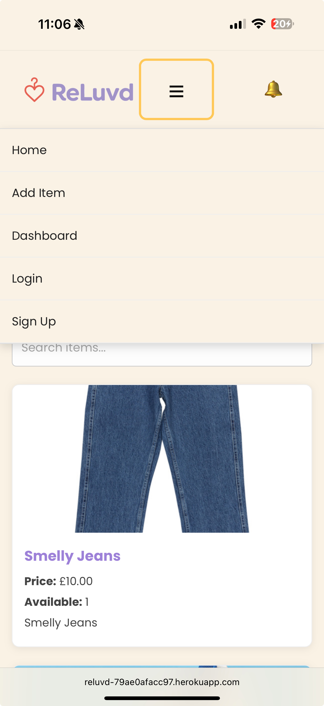

ReLuvd — Vinted-Style Django E-Commerce Marketplace

# Table of Contents

- [Live Site](#live-site)
- [Project Overview](#project-overview)
- [Purpose and Value](#purpose-and-value)
- [Target Audience](#target-audience)
- [Key Features](#key-features)
- [UX / Design](#ux--design)
  - [Wireframes](#wireframes)
  - [Key UX Goals](#key-ux-goals)
- [Deployment Instructions](#deployment-instructions)
  - [Clone Repository](#clone-this-repository)
  - [Install Dependencies](#install-dependencies)
  - [Environment Variables](#create-env-file-and-set-environment-variables)
  - [Apply Migrations](#apply-migrations)
  - [Create Superuser](#create-superuser)
  - [Run Locally](#run-locally)
  - [Stripe Test Details](#stripe-test-details)
- [Security](#security)
- [Data Structure](#data-structure)
  - [User Model](#1-user-model)
  - [Item Model](#2-item-model-itemsmodelsitem)
  - [Message Model](#3-message-model-itemsmodelsmessage)
  - [Order Model](#4-order-model-ordersmodelsorder)
  - [Review Model](#5-review-model-reviewsmodelsreview)
  - [Model Relationships Summary](#model-relationships-summary)
  - [ERD (Entity Relationship Diagram)](#erd-entity-relationship-diagram)
- [Rationale & Design Considerations](#rationale--design-considerations)
  - [Technology Stack Choices](#technology-stack-choices)
  - [Application Logic Considerations](#application-logic-considerations)
  - [Security-First Mindset](#security-first-mindset)
- [Entity Relationships](#entity-relationships)
  - [Entity Summary Table](#summary-table)
- [User Stories](#user-stories)
  - [General Users](#general-users)
  - [Sellers](#sellers)
  - [Security & Permissions](#security--permissions)
  - [Accessibility](#accessibility-1)
- [Testing](#testing)
- [Sample Seeded Data](#sample-seeded-data)
- [Credits](#credits)
- [File Structure](#file-structure)
- [Future Improvements](#future-improvements)
- [Known Issues](#known-issues)
- [TESTING.md](TESTING.md)
- [Bugs.md](bugs.md)

### Live Site

**Hosted on Heroku**: [Reluvd](https://reluvd-79ae0afacc97.herokuapp.com)

### Project Overview

ReLuvd is a full-stack Django web application that allows users to buy and sell second-hand items, similar to platforms like Vinted. The platform supports secure user registration, product listings, image uploads via Cloudinary, Stripe payments, full CRUD functionality, and an administrative backend.

### Purpose and Value

This site enables users to declutter, sell unwanted items, and discover affordable second-hand goods in a safe and easy-to-use environment.

For buyers: Browse, search, and securely purchase items using Stripe.

For sellers: List, edit, and manage items with full image support.

For admins: Manage users, orders, and products via Django Admin.

### Target Audience

Sustainable shoppers

Students looking for discounted goods

People decluttering unwanted items

### Key Features

User Registration, Login, Logout

User Dashboard with item management

Product Listings with full CRUD

Image Upload using Cloudinary

Stripe Payments (Test Mode)

Permissions & User Access Control

Admin Panel for full data management

Search & Filtering by Category

Fully responsive mobile-first design

Custom 404 error page

Full manual & automated testing suite

Fully seeded database for demo

- Technologies Used

Django 5.2 (Python)

PostgreSQL (Heroku add-on)

Stripe API (Test Mode)

Cloudinary (media storage)

HTML5, CSS3, Bootstrap

WhiteNoise (static file management)

Gunicorn (production server)

Faker (for database seeding)

Heroku (deployment)

Git & GitHub (version control)

Visual Studio code

Black formatter - Python

##  UX / Design

###  Wireframes
 As part of the design process, wireframes were created using draw.io to visualise the structure, layout, and user flow of the application before development began.

###  Key UX Goals
- Minimal, clean layout for both users and admins.
- Clear call-to-actions for creating and updating tickets.
- Responsive design across mobile, tablet, and desktop.

### Deployment Instructions

Clone this repository:

git clone http://github.com/mr-aust1n/milestone-project-four

Install dependencies:

pip install -r requirements.txt

Create .env file and set environment variables:

SECRET_KEY=your_django_secret_key
DEVELOPMENT=1
EMAIL_HOST_USER=your_email@gmail.com
EMAIL_HOST_PASSWORD=your_email_password

STRIPE_PUBLIC_KEY=your_stripe_public_key
STRIPE_SECRET_KEY=your_stripe_secret_key

CLOUDINARY_CLOUD_NAME=your_cloud_name
CLOUDINARY_API_KEY=your_api_key
CLOUDINARY_API_SECRET=your_api_secret

- Apply migrations:

python manage.py migrate

- Create superuser:

python manage.py createsuperuser

### Run locally:

python manage.py runserver

###  Stripe Test Details

This project uses Stripe test keys only.

No real payments are processed.

Use Stripe test card number: 4242 4242 4242 4242 for test payments.

see [TESTING.md](TESTING.md) for more info.

## Security

The following security measures have been implemented to ensure application integrity, user safety, and data protection:

- **Environment Variable Management:**
  - All sensitive configuration values (e.g., `SECRET_KEY`, `STRIPE_API_KEYS`, `CLOUDINARY_API_KEYS`, email credentials) are handled securely using environment variables.
  - A local `.env` file is used during development (loaded via `python-dotenv`) but excluded from version control via `.gitignore` to prevent credential leaks.
  - On deployment, all secrets are managed securely through Heroku Config Vars, ensuring no credentials are exposed in the codebase or repository.

  

- **Django Secret Key Protection:**
  - The `SECRET_KEY` is never hardcoded or committed.
  - On Heroku, the key is injected through environment variables.

- **Database Security:**
  - The PostgreSQL database credentials are secured through Heroku’s `DATABASE_URL` Config Var.
  - Django’s ORM protects against SQL injection by using parameterized queries.
  - Passwords are hashed and salted using Django’s built-in authentication system (PBKDF2 by default).

- **Payment Security via Stripe:**
  - All Stripe transactions are handled via client-side tokenization.
  - No sensitive card data touches the server at any point.
  - Stripe’s test mode keys are used for all development and demonstration purposes.

- **Image Upload Security:**
  - All uploaded media files are stored and served securely via Cloudinary.
  - Upload API keys are handled via environment variables.
  - Upload limits are enforced via Cloudinary’s built-in security features.

- **Permissions & Authorization:**
  - User authentication is required to access protected resources such as adding, editing, and deleting items.
  - Authorization logic ensures users cannot modify items, orders, or reviews that do not belong to them.
  - Django’s built-in `login_required` decorators and model-level checks are used to protect all restricted views.

- **Django Security Best Practices Applied:**
  - CSRF protection is enabled globally for all forms.
  - Session management uses Django's secure session framework.
  - Clickjacking protection enabled via `XFrameOptionsMiddleware`.
  - WhiteNoise properly handles static file serving without exposing filesystem paths.
  - Debug mode is automatically disabled in production.

- **Error Handling:**
  - Custom 404 page ensures graceful handling of bad requests.
  - Django’s DEBUG mode is never active in production.

## Data Structure

The application uses Django’s ORM to define the following models and relationships:

### 1 User Model

- Built-in Django `User` model (`django.contrib.auth.models.User`)
- Extended via ForeignKey relationships to connect items, orders, reviews, messages

---

### 2 Item Model (`items.models.Item`)

| Field        | Type             | Description                    |
|--------------|-------------------|----------------------------------|
| `title`      | CharField         | Title of the item (max 100)     |
| `description`| TextField         | Full item description           |
| `category`   | CharField         | Item category (choices list)    |
| `price`      | DecimalField      | Item price (max_digits=8, decimal_places=2) |
| `image`      | CloudinaryField   | Product image (stored on Cloudinary) |
| `seller`     | ForeignKey(User)  | Seller linked to user account |
| `date_posted`| DateTimeField     | Auto timestamp when posted      |
| `is_sold`    | BooleanField      | Sale status                     |
| `quantity`   | PositiveIntegerField | Quantity in stock           |

---

### 3 Message Model (`items.models.Message`)

| Field      | Type             | Description                |
|------------|-------------------|-----------------------------|
| `item`     | ForeignKey(Item)  | Linked item                |
| `sender`   | ForeignKey(User)  | Linked user (sender)       |
| `message`  | TextField         | Message content            |
| `created_at` | DateTimeField   | Timestamp                  |

---

### 4 Order Model (`orders.models.Order`)

| Field        | Type             | Description            |
|--------------|-------------------|------------------------|
| `item`       | ForeignKey(Item)  | Ordered item          |
| `buyer`      | ForeignKey(User)  | Buyer user            |
| `created_at` | DateTimeField     | Timestamp order created |
| `total_price`| DecimalField      | Total amount paid     |
| `is_offer`   | BooleanField      | If item was bought via offer |

---

### 5 Review Model (`reviews.models.Review`)

| Field      | Type             | Description               |
|------------|-------------------|---------------------------|
| `order`    | ForeignKey(Order) | Review linked to order   |
| `reviewer` | ForeignKey(User)  | User who left review     |
| `rating`   | IntegerField      | Rating score (1-5)       |
| `comment`  | TextField         | Review text              |
| `created_at`| DateTimeField    | Timestamp                |

---

### Model Relationships Summary

- A **User** can create many **Items**
- A **User** can place many **Orders**
- An **Order** contains one **Item**
- A **Review** belongs to one **Order**  (Future Feature)
- Messages link **Users** to **Items** for inquiries

## Rationale & Design Considerations

The primary objective behind building ReLuvd was to create a secure, fully functional Django e-commerce platform for second-hand goods, while demonstrating best practices in full-stack web application development.

### Technology Stack Choices:

- **Django Framework (Python):** 
  - Django was chosen for its built-in security, admin interface, scalability, and robust ORM system. 
  - Django's authentication system provides a secure foundation for user registration, login, permissions, and admin management.
  
- **PostgreSQL (Heroku):**
  - A production-grade relational database, fully integrated with Heroku and Django ORM.
  - Provides better scalability and stability than default SQLite for live deployment.

- **Stripe API:**
  - Provides fully secure, PCI-compliant payment handling.
  - Stripe's test environment allowed safe development and validation of payment workflows.

- **Cloudinary:**
  - Chosen to store all uploaded user images externally to handle media storage limitations on Heroku.
  - Cloudinary also allows for fast CDN-based image delivery and management.

- **Heroku (Deployment):**
  - Fully cloud-hosted environment, allowing for continuous deployment via GitHub.
  - Simplifies environment variable management and database add-on integration.

- **Bootstrap (CSS Framework):**
  - Allows for responsive, mobile-first design with rapid development of clean and accessible layouts.
  - Minimal custom CSS was layered on top to maintain accessibility and brand consistency.

- **WhiteNoise (Static Files):**
  - Enables serving of static assets directly from Heroku without requiring external storage.

- **Git & GitHub (Version Control):**
  - All development stages and feature branches were managed via Git, ensuring version history, rollback capability, and submission integrity.

### Application Logic Considerations:

- **Authentication Required for Core Features:**
  - Only registered users can list items for sale or complete purchases.
  - This adds both security and accountability to all platform participants.

- **Permissions & Ownership Logic:**
  - Only item owners can edit or delete their own listings.
  - All user-specific dashboards are isolated to prevent data leaks.

- **Simplified Checkout Process:**
  - Stripe handles payment logic, minimizing sensitive data handled by the application.
  - Orders directly update inventory (quantity reduction, sold status updates).

- **Database Seeding:**
  - A custom Django management command seeds the database with realistic test data for demonstration purposes.
  - Seed data allows for fully populated live demonstration even before active users join the system.

- **Error Handling:**
  - Custom 404 page provides user-friendly navigation if invalid routes are accessed.
  - Defensive validation applied to forms both client-side and server-side.

- **Scalability:**
  - The modular app structure allows for easy expansion (new features, categories, messaging system, etc).
  - Future upgrade paths include switching from Heroku to Render or full AWS stack.

### Security-First Mindset:

Every design choice included security best practices: no credentials exposed, all payments tokenized, image uploads restricted, permissions enforced, and static/media files properly separated.

## Entity Relationships

The following describes how each major entity in the system is related to others:

### User

- A `User` can:
  - Create multiple `Items` (One-to-Many)
  - Place multiple `Orders` (One-to-Many)
  - Leave multiple `Reviews` (One-to-Many)
  - Send multiple `Messages` (One-to-Many)

### Item

- An `Item`:
  - Belongs to one `User` (seller)
  - Can have multiple `Messages` (One-to-Many)
  - Can belong to one `Order` (when purchased)
  - Can only be edited or deleted by its seller

### Order

- An `Order`:
  - Belongs to one `User` (buyer)
  - Contains one `Item`
  - Can have one related `Review`

### Review

- A `Review`:
  - Belongs to one `Order`
  - Belongs to one `User` (reviewer)

### Message

- A `Message`:
  - Belongs to one `Item`
  - Belongs to one `User` (sender)
  - Linked directly to the item's seller

### Summary Table

| Entity  | Related To | Relationship |
|---------|------------|--------------|
| User | Item | One-to-Many |
| User | Order | One-to-Many |
| User | Review | One-to-Many |
| User | Message | One-to-Many |
| Item | Message | One-to-Many |
| Item | Order | One-to-One |
| Order | Review | One-to-One |

### ERD (Entity Relationship Diagram)

User
 ├──> Item (seller)
 ├──> Order (buyer)
 ├──> Review (reviewer)
 └──> Message (sender)

Item
 ├──> Order (purchased item)
 └──> Message (messages linked to item)

Order
 └──> Review (linked to order)

 

## User Stories

### General Users

- As a visitor, I want to register for an account so that I can buy and sell items.
- As a user, I want to securely log in and log out of my account.
- As a user, I want to view all available items for sale on the homepage.
- As a user, I want to search and filter items by category to find what I'm looking for.
- As a user, I want to view full item details, including description, price, and seller.
- As a user, I want to securely purchase items using Stripe.
- As a user, I want to view my own purchased orders and order history.
- As a user, I want to communicate with sellers by sending messages about items.
- As a user, I do not want to see sold items 

###  Sellers

- As a seller, I want to list new items for sale by uploading product details and images.
- As a seller, I want to edit or delete my own listings as needed.
- As a seller, I want to view offers and orders on my dashboard.
- As a seller, I want to manage inventory levels and automatically mark items as sold when out of stock.
- As a seller, I want to receive email notifications when I get new messages.

### Security & Permissions

- As a user, I want to ensure that I can only edit or delete my own items.
- As a user, I want to feel confident that my data is secure, and no sensitive card details are stored on the platform.
- As an admin, I want to access the Django admin panel to manage users, items, orders, and reviews.
See all test results here [TESTING.md](TESTING.md) 

### Accessibility

- As a mobile user, I want the site to be fully responsive and easy to navigate.
- As a visually impaired user, I want the site to be fully accessible and compatible with screen readers.
See all test results here [TESTING.md](TESTING.md) 

###  Testing

Full manual testing across all features.

Unit tests on models, forms, views, permissions, URLs

Error handling tests (404, invalid forms, etc.)

Accessibility tests via Lighthouse (score 90+)

W3C HTML & CSS validated

See all test results here [TESTING.md](TESTING.md) 

### Sample Seeded Data

3 test users created automatically via management command.

9 products populated using Cloudinary images:

Trainers, Leather Bag, Sunglasses, Hot Air Balloon, Watch, Cat, Deer, Steering Wheel, Spices.

All data generated via python manage.py seed_database

### Credits

Faker (for realistic seed data)

Cloudinary (image storage)

Stripe (test payment gateway)

Django Docs

Bootstrap Docs

YouTube - checkout help (https://www.youtube.com/watch?v=Ly_8hRHSfdk)

CSS reset - https://meyerweb.com/eric/tools/css/reset/

## File Structure

The project follows Django’s recommended modular app structure:

### Future Improvements

Favourites / Watchlist feature

Category expansion

Admin analytics dashboard

Visual improvements to HTML Email templates

Leave Reviews

Auto remove the product from the home screen once a product is sold and not to wait until the item is removed by the seller.

Add sold items to the 'my orders' page under sold items.

## Known Issues

- Email confirmation may sometimes be filtered to spam due to free tier email provider.
- This version is deployed using Heroku £5 tear — potential idle time delays when waking up app.
- Stripe integration remains in test mode for demonstration purposes only.