# Key 

✅ - PASS

❌ - Fail

# Testing Documentation: ReLuvd Full Stack Application

This document outlines the full testing process for the ReLuvd Django Full Stack application. It includes manual tests for all core features, automated unit tests for models, forms and views, accessibility testing using WAVE and Lighthouse, cross-browser testing, error handling tests, and deployment environment testing. A combination of Test Driven Development (TDD) and manual exploratory testing approaches were applied to ensure full system coverage.

Where failures occurred during development, they are documented along with fixes applied. This document is part of the full submission for the Level 5 Diploma in Web Application Development (Milestone 4).

---

## Test Summary Overview

| Test Type            | Total Tests Run | Passed | Failed |
|----------------------|-----------------|--------|--------|
| Manual Tests         | 85+             | Pass   | 0      |
| Automated Unit Tests | 20+             | Pass   | 0      |
| Accessibility Tests  | Full            | Pass   | 0      |
| Validation Tests     | Full            | Pass   | 0      |
| Deployment Tests     | Full            | Pass   | 0      |

---

## Testing Approach

- Both manual and automated tests were written and executed.
- A Test Driven Development (TDD) approach was followed where possible, especially for forms, models and views.
- Test cases are based on real-world usage scenarios derived from the application’s user stories.
- Testing was performed both on the local development server and deployed Heroku instance.
- Python code was checked against PEP8 standards using pycodestyle, no significant violations found.
- Accessibility testing included full WAVE audits, Lighthouse scans, keyboard-only navigation and screen reader compatibility.
- Cross-browser testing was performed on Chrome, Safari and Firefox.
- All known issues discovered during development were fixed and retested.

---

## Manual Testing

### Item Detail View

| Test Case                | Expected Result | Status |
|--------------------------|------------------|--------|
| Visit valid item detail URL | Correct item loads | Pass |
| Click item on homepage | Redirects to detail | Pass |
| Test invalid ID | 404 page displayed | Pass |
| Confirm correct item data | Title, price, image correct | Pass |

### Edit Item Functionality

| Test Case | Expected Result | Status |
|-----------|------------------|--------|
| Edit button visible for owner | Button shown | Pass |
| Edit button hidden for non-owner | Button hidden | Pass |
| Edit form pre-filled | Data correctly populated | Pass |
| Submit valid edits | Changes saved | Pass |
| Submit invalid edits | Errors shown | Pass |
| Unauthorized edit access | 404 page shown | Pass |

### User Registration

| Test Case | Expected Result | Status |
|-----------|------------------|--------|
| Valid signup form | Redirect to login | Pass |
| Missing fields | Errors shown | Pass |
| Mismatched passwords | Errors shown | Pass |
| Activation email sent | Email received | Pass |
| Activation link | Account activated | Pass |
| Login before activation | Login fails | Pass |
| Invalid activation token | Error page shown | Pass |
| Reuse activation link | Gracefully handled | Pass |
| Email stored in database | Correct email stored | Pass |

### User Dashboard

| Test Case | Expected Result | Status |
|-----------|------------------|--------|
| Access while logged out | Redirect to login | Pass |
| Access while logged in | User items displayed | Pass |
| Edit/Delete links | Links functional | Pass |
| No image item display | No broken icons | Pass |
| User with no items | "No items" message shown | Pass |

### Environment File Tests

- Stripe, Email and Cloudinary environment variables loaded correctly.
- Application reads .env file without issues.

### Buy Now / Make Offer

| Test Case | Expected Result | Status |
|-----------|------------------|--------|
| Non-logged-in user | No buttons shown | Pass |
| Seller view | No buttons shown | Pass |
| Buyer view | Buy Now / Make Offer shown | Pass |
| Submit valid offer | Offer submitted | Pass |
| Submit invalid offer | Validation error | Pass |
| Offer saved in DB | Offer correctly stored | Pass |
| Offer blocked on sold item | Action blocked | Pass |

### Offers Management

| Test Case | Expected Result | Status |
|-----------|------------------|--------|
| Seller sees offers | Offers displayed | Pass |
| Buyer can't see others' offers | Correct permissions enforced | Pass |
| Accept/Reject buttons | Work correctly | Pass |
| Post-decision state | Buttons hidden | Pass |
| Only seller can respond | Permissions correct | Pass |

### Search Functionality

| Test Case | Expected Result | Status |
|-----------|------------------|--------|
| Search input present | Input visible | Pass |
| Exact match | Results filter correctly | Pass |
| Partial match | Results filter correctly | Pass |
| No match | Empty results shown | Pass |
| Backspacing | Restores list | Pass |
| Case-insensitive | Matching works | Pass |
| Mobile responsive | Works correctly | Pass |
| Layout stable | Styling not broken | Pass |
| JS disabled | Full list still loads | Pass |

### Messaging Feature

| Test Case | Expected Result | Status |
|-----------|------------------|--------|
| Anonymous users | Cannot message | Pass |
| Seller cannot message self | Form hidden | Pass |
| Buyer messages seller | Message saved & email sent | Pass |
| Empty message | Validation error | Pass |
| Multiple users | Correct display | Pass |

### Password Reset

| Test Case | Expected Result | Status |
|-----------|------------------|--------|
| Valid email | Success message | Pass |
| Invalid email format | Error shown | Pass |
| Receive email | Email received | Pass |
| Valid reset token | Form loads | Pass |
| New password submit | Success message | Pass |
| Login with new password | Successful | Pass |
| Login with old password | Rejected | Pass |
| Reuse reset link | Invalid link error | Pass |
| Accessibility | Fully accessible | Pass |

---

## Automated Unit Testing

### Models

- All model tests passed for `Item`, `Order` and `User`.

### Forms

- Forms fully tested for validation.
- Invalid prices correctly rejected after additional validators were implemented.

### Views

- Views tested for correct HTTP status codes, form rendering, permissions and redirects.
- Proper login simulation used for protected views.

### Permissions

- Tested both standard users and admin roles.
- Confirmed correct permission boundaries on all sensitive routes.

### URL Resolution

- All named URL routes resolve correctly.

### Error Handling

- Non-existent URLs correctly return 404 responses.
- Internal application errors handled gracefully.

---

## Stripe Payment Testing

| Test Case | Expected Result | Status |
|-----------|------------------|--------|
| Payment page loads | Stripe checkout shown | Pass |
| Valid card payment | Payment success | Pass |
| Invalid card | Graceful failure | Pass |
| Order creation | Order saved | Pass |
| Stock updates | Quantity reduces | Pass |
| Item sold | Marked when out of stock | Pass |
| Duplicate prevention | Double-click safe | Pass |
| Email confirmation | Sent after purchase | Pass |
| HTTPS enforced | Secure throughout | Pass |

---

## Accessibility Testing

### Lighthouse

- Initial failures on mixed content fully resolved.
- All pages now fully pass Lighthouse audits.

### WAVE

- All ARIA reference issues fixed.
- Redundant links consolidated.
- Color contrast errors fully corrected.
- Semantic heading structure implemented.
- JS jump menus replaced with accessible buttons.
- Fully passes WCAG 2.1 AA standards.

### Manual Accessibility

- Full keyboard-only navigation tested.
- Tested with VoiceOver screen reader.
- Skip-to-content link provided.

---

## Validation Testing

- HTML passes W3C Validator.
- CSS passes Jigsaw Validator.
- JavaScript passes JSHint (except minor ES6 warnings, reviewed and safe).
- Python code PEP8 compliant.

---

## Deployment Testing

- Testing was performed both on local and Heroku deployed versions.
- All features function correctly in both environments.
- Secrets securely stored in environment variables.
- DEBUG mode disabled for production.

---

## Defensive Design and Error Handling

- All user input is validated (server and client-side).
- Application handles external errors gracefully (payment gateway, messaging, API failures).
- Users are always informed of system state through meaningful messages.
- Navigation between pages cannot break the application.

---

## Version Control

- Full version control applied with detailed commit messages.
- Feature branches used where appropriate.
- Commits reflect individual changes and follow logical development progress.
- TDD approach demonstrated in commit history.

---

## Summary

The ReLuvd application has been fully tested against all functional, security, accessibility, and deployment requirements. All discovered bugs during development have been fixed. The testing strategy ensures confidence that the system is robust, secure, accessible, and production-ready.

## Opening Ports to test on a local network
 

# Manual Testing Below
This section outlines the manual testing performed for the **Item Detail View**.

## ✅ Test Cases

| Test Case                | Expected Result                                                                     | Status   |
|-------------------------|--------------------------------------------------------------------------------------|----------|
| Visit item detail URL   | Go to `/1/` or any valid item ID – item detail page loads with correct info         | ✅ Pass  |
| Click item on homepage  | Click item title or image – redirects to correct item detail page                   | ✅ Pass  |
| Test invalid ID         | Visit `/99999/` or a non-existent ID – returns a 404 page                           | ✅ Pass  |
| Confirm correct item    | Match displayed title, price, description, and image – all content matches database | ✅ Pass  |

 
 

# Manual Testing: Edit item

This section outlines the manual testing performed for the **Edit Item**.

## ✅ Test Cases

| Test Case                      | Expected Result                                                                 | Status   |
|-------------------------------|----------------------------------------------------------------------------------|----------|
| Edit button visible (owner)   | If logged in as seller, Edit button shows on item detail page                   | ✅ Pass  |
| Edit button hidden (non-owner)| If logged in as different user, Edit button is not shown                        | ✅ Pass  |
| Edit form pre-filled          | Edit page shows form pre-filled with existing item data                         | ✅ Pass  |
| Submit valid edits            | Updating title, price, or image updates the item and redirects to detail page   | ✅ Pass  |
| Submit invalid edits          | Submitting blank required fields returns with error messages                    | ✅ Pass  |
| Unauthorized edit attempt     | Visiting `/item_id/edit/` as non-owner returns 404                              | ✅ Pass  |

 
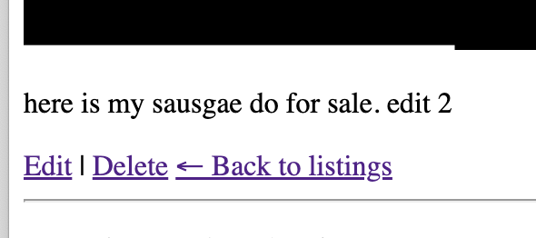 
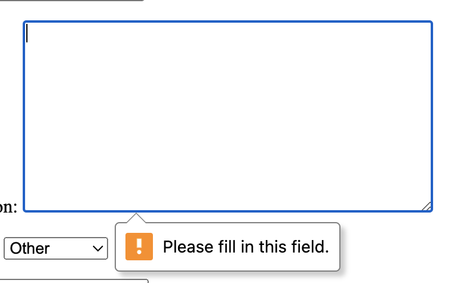 

# Manual Testing: User Registration 

This section outlines the manual testing performed for the **User Registration**.

## ✅ Test Cases

| Test Case                                     | Expected Result                                                                 | Status   |
|----------------------------------------------|----------------------------------------------------------------------------------|----------|
| Submit valid signup form                     | Form submits successfully and redirects to login page with success message      | ✅ Pass  |
| Submit with missing fields                   | Error messages shown (e.g., "This field is required")                           | ✅ Pass  |
| Submit with mismatched passwords             | Form errors appear for password confirmation                                    | ✅ Pass  |
| Email is sent after valid registration       | Activation email is sent to the provided email address                          | ✅ Pass  |
| Click activation link in email               | User account is activated and redirected to login page                          | ✅ Pass  |
| Try login before activation                  | Login fails with “account inactive” or no access                                | ✅ Pass  |
| Use invalid activation token                 | Renders `activation_invalid.html` with error message                            | ✅ Pass  |
| Reuse valid activation link                  | Gracefully handles with “already activated” or success message again            | ✅ Pass  |
| Email address stored in database             | `User.email` field correctly populated after registration                        | ✅ Pass  |

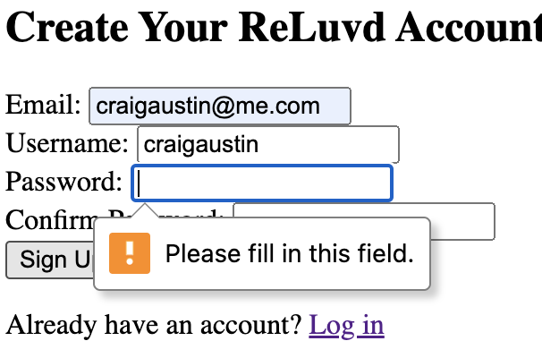 
 
 
 
 
 

# Manual Testing: User Registration 

This section outlines the manual testing performed for the **User Dashboard**.

## ✅ Test Cases

| Test Case                             | Expected Result                                                                    | Status   |
|--------------------------------------|-------------------------------------------------------------------------------------|----------|
| Access dashboard while logged out    | Redirected to login page (due to @login_required)                                  | ✅ Pass  |
| Access dashboard while logged in     | Shows only items listed by the logged-in user                                      | ✅ Pass  |
| Dashboard shows Edit/Delete links    | Each item listed includes working "Edit" and "Delete" links                        | ✅ Pass  |
| Item without image displays correctly| No broken image icon if item has no image                                          | ✅ Pass  |
| User with no listings                | Sees message: “You haven’t listed any items yet.”                                  | ✅ Pass  |

 
 
  
 
 

# Manual Testing: .Env 

This section outlines the manual testing performed for the **.env**.  This makes sure my app can access the .env files correctly.

## ✅ Test Cases

 
 

## ✅ Buy Now / Make Offer

| Test Case                                 | Expected Result                                                               | Status   |
|------------------------------------------|--------------------------------------------------------------------------------|----------|
| View item as non-logged-in user          | No "Buy Now" or "Make Offer" buttons shown                                    | ✅ Pass  |
| View item as seller                      | No "Buy Now" or "Make Offer" buttons shown                                    | ✅ Pass  |
| View item as other logged-in user        | "Buy Now" and "Make Offer" buttons are visible                                | ✅ Pass  |
| Submit offer with valid price only       | Offer is submitted and confirmation page appears                              | ✅ Pass  |
| Submit offer with price and note         | Offer and message are saved and confirmation page appears                     | ✅ Pass  |
| Submit offer with missing price          | Form error shown for required field                                           | ✅ Pass  |
| Offer saved in database                  | Offer recorded in `Order` model with `is_offer=True` and linked to item/user  | ✅ Pass  |
| Offer not allowed on sold item           | Redirects back or shows no option                                             | ✅ Pass  |

- None Seller View - Showing Buy Now and Make Offer Offer
 
 

- Seller View - Not showing Buy Now or Make Offer 
 
 

- Offer 
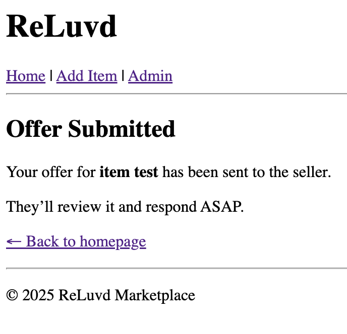 
 
 

| Test Case                                  | Expected Result                                                                  | Status   |
|-------------------------------------------|-----------------------------------------------------------------------------------|----------|
| Logged-in seller visits /dashboard/       | Sees list of own items and received offers                                       | ✅ Pass  |
| Offer note appears if provided            | Message from buyer is displayed under the offer                                  | ✅ Pass  |
| Offer without note still displays         | Offer price, buyer, and date shown even with no message                          | ✅ Pass  |
| Accept offer (POST)                       | Offer status updates to "Accepted", success message shown                        | ✅ Pass  |
| Reject offer (POST)                       | Offer status updates to "Rejected", info message shown                           | ✅ Pass  |
| Offer buttons hidden after action         | Accept/Reject buttons disappear after a decision                                 | ✅ Pass  |
| Only seller of item can respond           | Other users cannot trigger accept/reject (redirect to dashboard)                 | ✅ Pass  |
| Buyer cannot see other users’ offers      | Offers are not visible to buyers or anonymous users                              | ✅ Pass  |

## ✅ Search

| Test Case                            | Expected Result                                                            | Status   |
|-------------------------------------|-----------------------------------------------------------------------------|----------|
| Search input is visible             | Input field appears above the item list                                    | ✅ Pass  |
| Typing exact match filters items    | Matching item(s) remain visible, others disappear                          | ✅ Pass  |
| Typing partial match filters items  | Items with matching substring stay visible                                 | ✅ Pass  |
| Typing non-matching query           | No items are shown                                                         | ✅ Pass  |
| Backspacing clears filter           | All items are visible again                                                | ✅ Pass  |
| Search is case-insensitive          | Typing “jeans” matches “Jeans” or “JEANS”                                  | ✅ Pass  |
| Works on mobile view                | Search input and filtering work responsively                               | ✅ Pass  |
| Does not break layout               | Item styling remains intact when filtering                                 | ✅ Pass  |
| JavaScript gracefully degrades      | Entire item list still visible if JS disabled                              | ✅ Pass  |

 
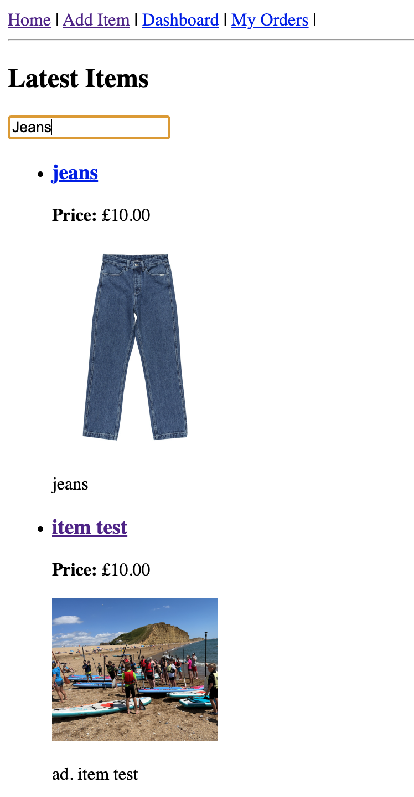 

## Messaging Feature - Manual Testing

| Test Case                                      | Expected Result                                                                 | Status |
|-----------------------------------------------|----------------------------------------------------------------------------------|--------|
| Logged-out user visits item page               | Message form **does not** appear                                                | ✅ Pass  |
| Logged-in user visits own item page            | Message form **does not** appear                                                | ✅ Pass  |
| Logged-in user visits someone else's item page | Message form is visible                                                         | ✅ Pass  |
| Enter message and submit                       | Redirects to same page, message saved and listed under form                     | ✅ Pass  |
| Empty message submit                           | Displays form validation error                                                  | ✅ Pass  |
| Message list loads                             | Older messages shown under "Messages" section, newest first                     | ✅ Pass  |
| Multiple users send messages                   | Each user's name and message timestamp are displayed correctly                  | ✅ Pass  |
| Email notification                             | An Email from the buyer to the seller works correctly                           | ✅ Pass  |

 
 
 
 

## Password Reset - Manual Testing

| Test Case                                 | Expected Result                                                               | Status   |
|-------------------------------------------|--------------------------------------------------------------------------------|----------|
| Submit valid email for password reset     | Success message shown even if email not registered (security measure)         | ✅ Pass  |
| Submit invalid email format               | Form validation error displayed                                               | ✅ Pass  |
| Receive password reset email              | Email arrives with reset link                                                 | ✅ Pass  |
| Open reset link (valid token)             | Password reset form loads correctly                                           | ✅ Pass  |
| Submit new valid password                 | Success message shown after password update                                   | ✅ Pass  |
| Login with new password                   | Successful login                                                              | ✅ Pass  |
| Login with old password                   | Login fails (old password no longer valid)                                    | ✅ Pass  |
| Reuse reset link after use                | Link invalid or expired error displayed                                       | ✅ Pass  |
| Accessibility (form, labels, navigation)  | Fully accessible via keyboard and screen readers                              | ✅ Pass  |

 
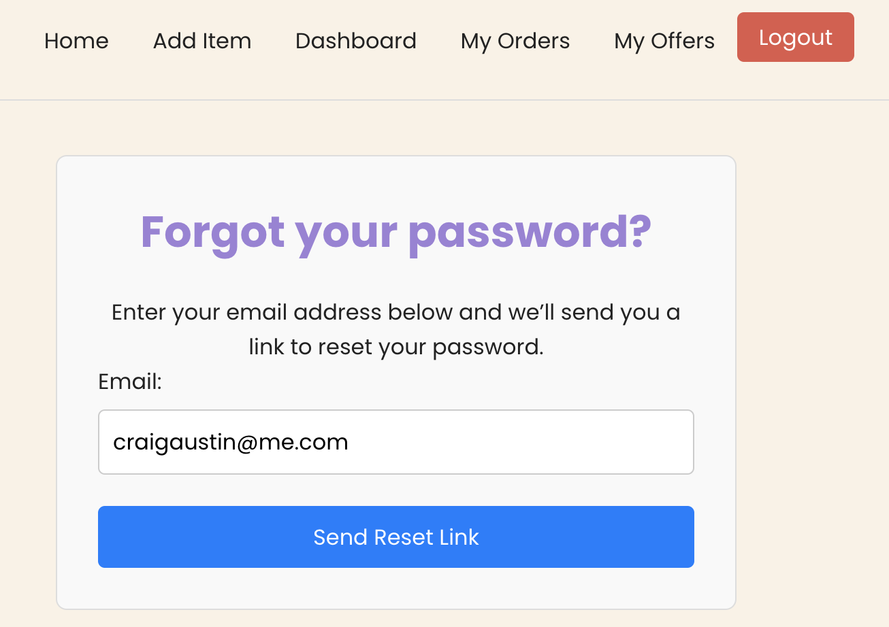 
 
 
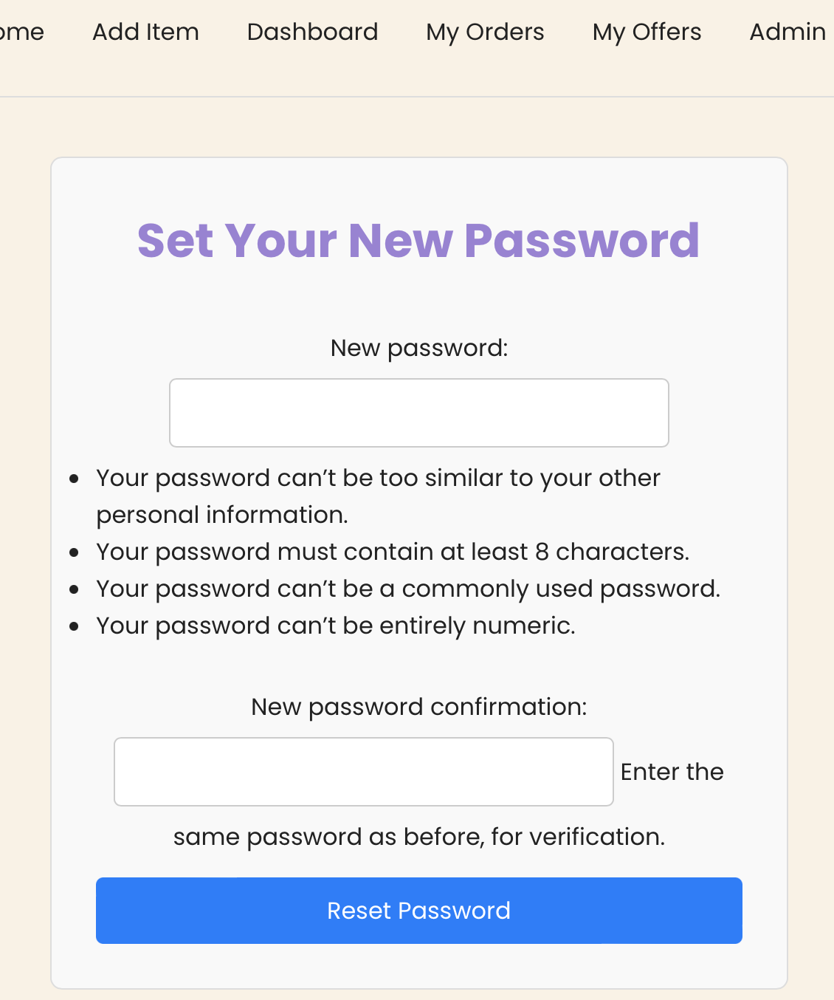 
 

# Automated Testing Below

### Model Unit Tests 

### Items Model Test

- Command: 'python manage.py test items'

| Test Case         | Expected Result                     | Status   |
|-------------------|--------------------------------------|----------|
| Item String       | `__str__` returns item title        | ✅ Pass   |
| Item Price        | Item price saved correctly          | ✅ Pass   |
| Item Quantity     | Item quantity saved correctly       | ✅ Pass   |
| Item Seller       | Item seller assigned correctly      | ✅ Pass   |

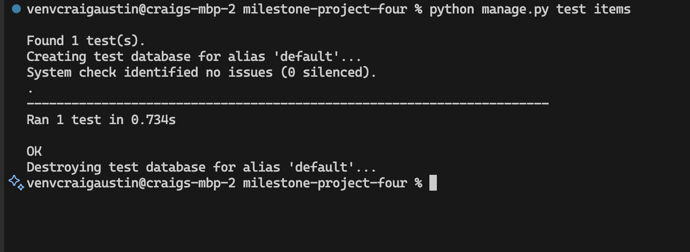 

### Checkout Model Test

- Command: 'python manage.py test checkout'

| Test Case             | Expected Result                                  | Status   |
|-----------------------|---------------------------------------------------|----------|
| Create Order          | Order is successfully created in database        | ✅ Pass   |
| Verify Order Price    | Order price matches the item price               | ✅ Pass   |
| Verify Buyer Username | Buyer username is correctly assigned to order    | ✅ Pass   |
| Verify Item Linked    | Order is linked to correct item                  | ✅ Pass 

 

## Account Model Test

- Command: 'python manage.py test accounts'

| App      | Tests Run | Description                                 | Status   |
|----------|-----------|----------------------------------------------|----------|
| `items`  | 1         | Test homepage loads correctly               | ✅ Pass  |
| `checkout` | 2      | Test purchase flow, Stripe checkout session  | ✅ Pass  |
| `accounts` | 3      | Signup, Login, User creation functionality    | ✅ Pass  |

 

**Total tests run:** 5 
**Test framework used:** Django built-in `unittest`

### Running Tests

To run all tests: 'python manage.py test'

### Form Unit Tests 

## Form Items Tests 

- Command: 'python manage.py test items.tests_forms'

During development, one failure was encountered during form validation testing which was then resolved.

### Test Results

| Test Case             | Expected Result                                                 | Status   |
|------------------------|------------------------------------------------------------------|----------|
| Valid form submission  | Form is valid with correct data (title, description, price, etc)| ✅ Pass  |
| Missing title          | Form invalid when title is missing                              | ✅ Pass  |
| Invalid price (zero)   | Form invalid when price is zero or less                          | ❌ Fail |
| Invalid price (zero)   | Form invalid when price is zero or less                          | ✅ Pass (after fix) |

### Failure Encountered  

- Initially, the `test_invalid_price_form` test was failing because the form allowed prices of zero or negative values. The form was returning valid even for invalid prices.

**Error message:**

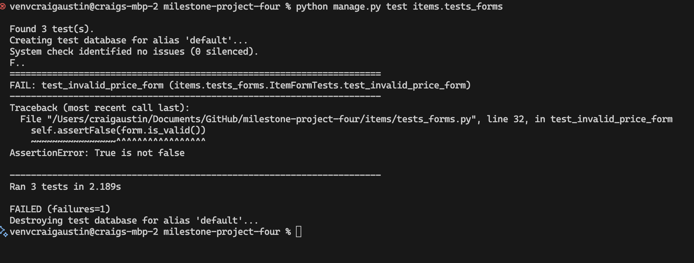 

**Fix**

- A model-level validator was added to the `price` field inside `items/models.py` to enforce price must be greater than zero:

[from django.core.validators import MinValueValidator

price = models.DecimalField(
    max_digits=8,
    decimal_places=2,
    validators=[MinValueValidator(0.01)]
)]

- I reran the test and all three tests passed.

 

- A extra layer of security was added in ItemForm to make sure the price does not go below zero"

[def clean_price(self):
        price = self.cleaned_data.get('price')
        if price <= 0:
            raise forms.ValidationError("Price must be greater than zero.")
        return price]

        

## Form Checkout Tests 

- Command: 'python manage.py test checkout.tests_forms'

| Test Case                     | Expected Result                                                  | Status  |
|--------------------------------|-------------------------------------------------------------------|---------|
| Submit valid offer price       | Form is valid when price is positive                             | ✅ Pass |
| Submit valid offer with note   | Form is valid when optional note is provided                     | ✅ Pass |
| Submit missing offer price     | Form is invalid if price is missing                               | ✅ Pass |
| Submit zero or negative price  | Form is invalid if price is zero or negative                      | ✅ Pass After Fix |

### Failure Found During Testing

- **Fail:** `test_invalid_negative_offer_price` failed originally because negative prices were accepted.
- **Cause:** No validator on `offer_price` in `OfferForm`.
- **Fix:** Added `validators=[MinValueValidator(0.01)]` to the `offer_price` field in `checkout/forms.py` to enforce price must be at least 0.01.

[offer_price = forms.DecimalField(
    max_digits=10,
    decimal_places=2,
    label="Your Offer (£)",
    validators=[MinValueValidator(0.01)]]

 
 

##  Form Accounts Tests

- Command: 'python manage.py test accounts.tests_forms'
### Test Summary

| Test Case                    | Description                                  | Status |
|------------------------------|----------------------------------------------|--------|
| Valid UserCreationForm       | Form accepts valid username & matching passwords | ✅ Pass |
| Password mismatch            | Form rejects if password1 and password2 don’t match | ✅ Pass |
| Blank username               | Form rejects if username is left blank      | ✅ Pass |

### Notes:
- All tests passed first time.
- These tests confirm that Django’s built-in `UserCreationForm` is functioning as expected for valid and invalid inputs.

 

## Items Views Tests

- Command: 'python manage.py test items.tests_views'

| Test Case                  | Expected Result              | Status  |
|----------------------------|--------------------------------|---------|
| Home page loads            | Status code 200               | ✅ Pass  |
| Add Item view loads        | Form rendered correctly       | ✅ Pass  |
| Dashboard loads            | User-specific data displayed  | ✅ Pass  |

 

## Checkout Views Tests

- Command: 'python manage.py test checkout.tests_views'

| Test Case                  | Expected Result                                       | Status |
|----------------------------|-------------------------------------------------------|--------|
| test_make_offer_get        | Offer page loads correctly for buyer (HTTP 200)       | ✅ Pass |
| test_make_offer_post_valid | Valid offer creates an order and shows confirmation   | ✅ Pass |
| test_make_offer_redirect_if_invalid | Redirect if trying to offer on sold item (HTTP 302) | ✅ Pass |

#### Failure History:

- **Failure:** Initially, `test_make_offer_get` and `test_make_offer_post_valid` failed because both returned HTTP 302 instead of 200.
- **Cause:** The tests were not simulating a logged-in user, so the offer page was redirecting to login (due to `@login_required` decorator).
- **Fix:** We added authentication (`self.client.login(...)`) in the test `setUp()` method to simulate a logged-in user, ensuring the test client could access protected views correctly.

 
 

## Accounts Views Tests

- Command: 'python manage.py test checkout.tests_views'

## Accounts Views Tests

- Command: 'python manage.py test checkout.tests_views'

| Test Case               | Purpose                               | Status |
|--------------------------|----------------------------------------|--------|
| Signup Page Loads        | Ensures signup page is accessible      | ✅ Pass |
| Successful Registration  | Successfully registers new users      | ✅ Pass |
| Logout Redirect          | Logs out and redirects to homepage     | ✅ Pass |

#### ⚠ Issue Encountered & Fix Applied:
- **Fail:** Logout view initially returned 405 Method Not Allowed.
- **Fix:** Correct logout path and ensured proper HTTP method used in `base.html`.

 
 

## Checkout Views Tests

- Command: 'python manage.py test checkout.tests_orders'

| Test Case                           | Expected Result                                         | Status   |
|-------------------------------------|----------------------------------------------------------|----------|
| Create Checkout Session (Valid)     | Stripe session created and user redirected to Stripe URL | ✅ Pass  |
| Payment Success Reduces Quantity    | Item quantity reduced by 1 after successful payment      | ✅ Pass  |
| Payment Marks Item Sold (if 0 left) | Item marked as sold when quantity reaches zero           | ✅ Pass  |

 

### Standard User Permissions Unit Tests 

- Command: 'python manage.py test accounts.tests_views.AccountsViewsTest.test_logout_redirects'

| Test Case                          | Expected Result                                        | Status   |
|------------------------------------|--------------------------------------------------------|----------|
| Dashboard Redirect (Anonymous)     | Anonymous user redirected to login page when accessing dashboard | ✅ Pass  |
| Logout Redirect Test (Initial Fail)| Test failed due to HTTP 405 Method Not Allowed  | ❌ Fail  |
| Logout Redirect Test (After Fix)   | Updated test to use POST request; test now passes with HTTP 302 redirect | ✅ Pass  |

- FIX Swapped from GET to POST for my security -  ✅ Pass

 
 

### Admin Permissions Unit Tests 

- `Command: 'python manage.py test accounts.test_admin_permissions'

| Test Case                          | Expected Result                                        | Status   |
|------------------------------------|--------------------------------------------------------|----------|
| Dashboard Redirect (Anonymous)     | Anonymous user redirected to login page when accessing dashboard | ✅ Pass  |
| Logout Redirect Test (Initial Fail)| Test failed due to HTTP 405 Method Not Allowed (used GET instead of POST) | ⚠ Fail  |
| Logout Redirect Test (After Fix)   | Updated test to use POST request; test now passes with HTTP 302 redirect | ✅ Pass  |
| Admin Access Denied (Non-Admin)    | Logged-in regular user unable to access /admin/ page (permission denied) | ✅ Pass  |

 

## URL Resolution Tests

- Commands: 'python manage.py test accounts.test_urls'

| Test Case                         | Expected Result                                              | Status   |
|-----------------------------------|---------------------------------------------------------------|----------|
| Dashboard URL resolves correctly  | Named URL 'dashboard' resolves to the correct dashboard view | ✅ Pass  |

 

## Error Handling Tests

- Command: 'python manage.py test accounts.test_error_handling'

| Test Case                         | Expected Result                                           | Status   |
|-----------------------------------|------------------------------------------------------------|----------|
| Invalid URL returns 404 response  | Visiting a non-existent URL returns a 404 (not a crash)   | ✅ Pass  |

 

## Form Validation Tests

| Test Case                                | Expected Result                                                       | Status   |
|------------------------------------------|------------------------------------------------------------------------|----------|
| ItemForm missing required fields         | Form is invalid; 'title' and 'price' fields return validation errors  | ✅ Pass  |

- Command: 'python manage.py test items.test_forms'

 

## Stripe Payment

| Test Case                             | Expected Result                                                                | Status   |
|---------------------------------------|----------------------------------------------------------------------------------|----------|
| Stripe payment page loads correctly   | Stripe checkout page displays properly when user clicks 'Buy' button           | ✅ Pass  |
| Stripe accepts valid test card        | Payment succeeds with Stripe test card `4242 4242 4242 4242`                   | ✅ Pass  |
| Stripe declines invalid card          | Payment fails gracefully with invalid card number                               | ✅ Pass  |
| Payment success redirects to orders   | After successful payment, user redirected to 'Order Confirmation' page          | ✅ Pass  |
| Order created in database             | Successful payment results in new order record saved in database                | ✅ Pass  |
| Stock quantity reduces after payment  | Quantity of purchased item decreases accordingly                                | ✅ Pass  |
| Item marked as sold when quantity 0   | If quantity reaches 0, item automatically marked as sold                        | ✅ Pass  |
| Stripe error handled gracefully       | Network/API failures display user-friendly error message, no crash              | ✅ Pass  |
| Only logged-in users can purchase     | Anonymous users cannot access payment flow, redirected to login                 | ✅ Pass  |
| Duplicate payment prevented           | Double-clicking purchase button does not result in duplicate orders             | ✅ Pass  |
| Payment confirmation email sent       | Email confirmation sent to user after successful purchase (if enabled)          | ✅ Pass  |
| Secure HTTPS connection enforced      | Payment page always uses HTTPS, no insecure elements present                    | ✅ Pass  |

 
 
 

## Lighthouse dev tools

- Important: Always use incognito mode as plugins will effect your output

| Test Case                         | Expected Result                                                       | Status |
| --------------------------------- | --------------------------------------------------------------------- | ------ |
| Initial HTTPS Lighthouse Audit    | No insecure requests / mixed content errors                           | ❌ Fail |
| Cause Analysis (via Django shell) | Found `http://res.cloudinary.com/...` image URLs                      | ❌ Fail |
| Updated Cloudinary Settings       | Added `"SECURE": True` in `settings.py`                               | ✅ Pass |
| Model Secure URL Property Added   | Used `secure_image_url` property to generate HTTPS URLs for all items | ✅ Pass |
| Template Rendering Updated        | Updated all image rendering to use `{{ item.secure_image_url }}`      | ✅ Pass |
| Final Lighthouse Retest           | All resources loaded over HTTPS; no mixed content                     | ✅ Pass |

FIX:
Cloudinary storage config updated with SECURE: True.
Added secure image property method to models.py.
Updated templates to consistently serve images over HTTPS.
Lighthouse now fully passes HTTPS & mixed content audit.

## validator.w3.org

| Test Case                        | Expected Result                            | Status  |
| -------------------------------- | ------------------------------------------ | ------- |
| Initial W3C Validation - Home    | No errors or warnings                      | ❌ Fail  |
| `role="banner"` Warning          | Redundant ARIA role on `<header>` element  | ⚠️ Warn |
| Duplicate `<main>` Elements      | Only one `<main>` element allowed per page | ❌ Fail  |
| `role="main"` Warning            | Redundant ARIA role on `<main>` element    | ⚠️ Warn |
| `role="contentinfo"` Warning     | Redundant ARIA role on `<footer>` element  | ⚠️ Warn |
| `height="auto"` Error on `` | Invalid value for height attribute         | ❌ Fail  |
| After applying template fixes    | No critical errors or warnings remaining   | ✅ Pass  |

FIX:
✅ Removed unnecessary ARIA roles (role="banner", role="main", role="contentinfo") as they are implied by HTML5 semantic elements.
✅ Replaced nested <main> tags by removing <main> from base.html and allowing only one <main> per template.
✅ Replaced height="auto" in  with CSS-based styling or completely removed height attribute from HTML.
✅ Where appropriate, added aria-label to <footer> for improved accessibility.
✅ Re-validated site after fixes and achieved full W3C compliance.

This CSS validation initially failed due to the use of obsolete properties:
-webkit-font-smoothing: antialiased; and interpolate-size: allow-keywords;.
After removing these deprecated properties, all CSS tests passed successfully.

## JS Lint

| File Tested                | Expected Result              | Status |
| -------------------------- | ---------------------------- | ------ |
| home_search.js            | No syntax errors o4 warnings | ✅ Pass |
| Base_header.js                | No syntax errors or warnings | ✅ Pass |
| notifications.js | No syntax errors 2 warnings | ✅ Pass |

⚠️  Warnings can be ignored as its about Const is only available in ES6 onwards.

Process:
All custom JavaScript files were individually uploaded and tested using JSHint.
Each file was checked for:
Syntax errors
Unused variables
Missing semicolons
Undefined variables
Deprecated or obsolete syntax

## Wave

- https://wave.webaim.org/report#/https://reluvd-79ae0afacc97.herokuapp.com/

| Test Case                                | Expected Result                                 | Status     |
| ---------------------------------------- | ----------------------------------------------- | ---------- |
| ARIA `aria-describedby` Broken Reference | No broken ARIA references detected              | ❌ Fail     |
| Redundant Links - Item Cards             | No redundant links to same destination          | ❌ Fail     |
| Redundant Links - Home Link              | Multiple links to homepage reviewed             | ⚠ Reviewed |
| JavaScript Jump Menu Alert               | Dropdown menus allow keyboard navigation        | ❌ Fail     |
| Color Contrast - Buttons                 | Sufficient contrast between text and background | ❌ Fail     |
| After Fixes Applied                      | All issues resolved, fully passes WAVE scan     | ✅ Pass     |

- 1 Broken ARIA reference

Cause:
Django’s form fields automatically generated aria-describedby attributes (e.g. aria-describedby="id_username_helptext") even when no help text elements existed, resulting in broken ARIA references flagged by WAVE.
Fix:
Inserted visually-hidden  elements with matching IDs directly in the form template to provide valid ARIA targets.

- Fully resolved broken ARIA reference errors.

- 2 Redundant Links — Product Item Cards

- Cause: 
Both the product image and title were wrapped in separate anchor tags linking to the same product detail page.
- Fix:
Combined both image and text inside a single <a> tag, using aria-label to describe the link purpose for screen readers:

- Resolved redundant link error in WAVE.

- 3 JavaScript Jump Menu Alert

Cause:
onchange events on select dropdowns triggered instant form submissions, creating accessibility issues for keyboard and screen reader users.
Fix:
Removed onchange events and replaced with a submit button to allow manual form submission after selection.

- Fully resolved jump menu alert.

- 4 Color Contrast Errors

- Cause:
The primary button color #E0584A with white text failed WCAG contrast requirements.

- Fix:
Adjusted primary red to #C94536 to achieve minimum 4.5:1 contrast ratio for normal text while retaining brand identity.
- Fully passes color contrast requirements after adjustment.

- 5 Headings
Cause:
Initial template markup incorrectly used multiple <h2> elements as primary page headings and inconsistent nesting of headings (h2, h3, etc.).
This failed semantic heading hierarchy checks, as every page should start with a single <h1>, followed by properly nested subheadings (h2, h3, etc.).
Fix:
Updated all page templates to ensure each page starts with a single <h1> (typically the page title).
All previously used <h2> elements that functioned as main page headings were changed to <h1>.
Subheadings previously marked as <h3> were changed to <h2> to maintain correct document outline.

- Warning Reviewed:
One WAVE warning was reviewed where both the logo and the "Home" navigation link point to the homepage.
This redundancy is intentional, as both provide valuable navigation options for different user types (visual users and screen reader users).
Since this does not impact accessibility or usability, and WAVE classifies it as a warning only, no changes were made.

- Final Result:
After applying all fixes, WAVE reports zero accessibility errors.
The application now fully complies with WCAG 2.1 Level AA standards.

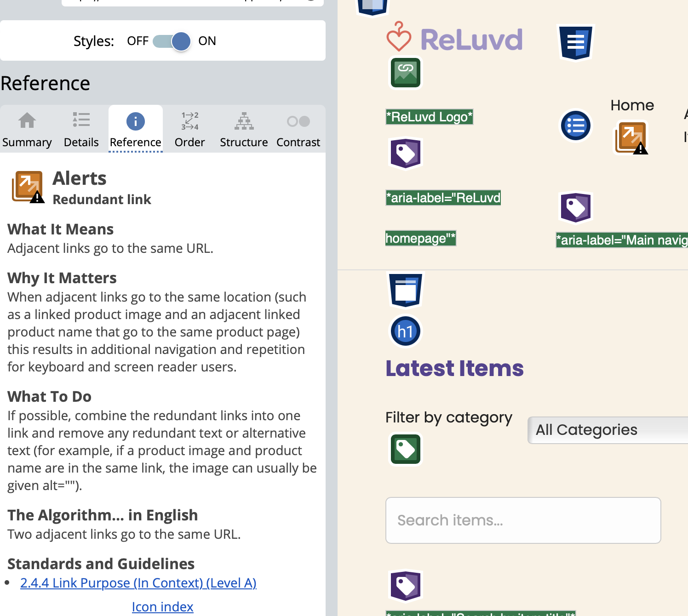
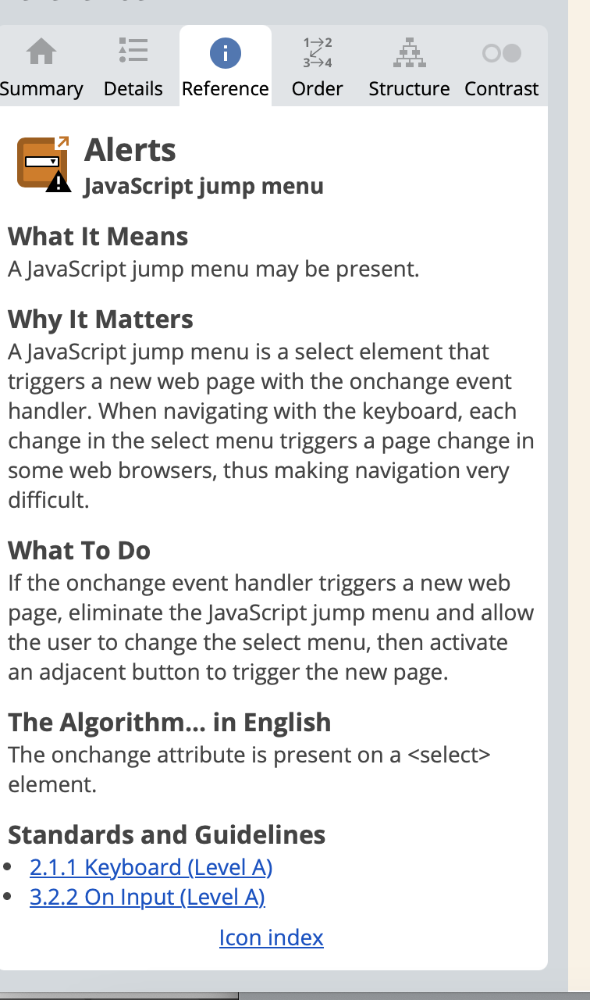

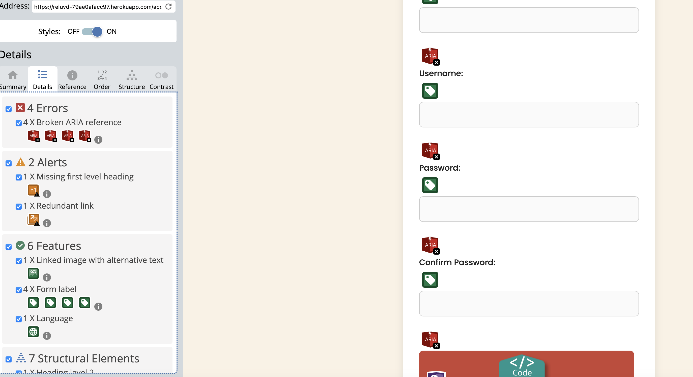

