# Key 

✅ - PASS

❌ - Fail

## Opening Ports to test on a local network
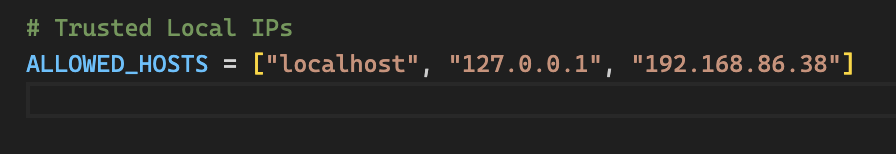 

# Manual Testing Below
This section outlines the manual testing performed for the **Item Detail View**.

## ✅ Test Cases

| Test Case                | Expected Result                                                                     | Status   |
|-------------------------|--------------------------------------------------------------------------------------|----------|
| Visit item detail URL   | Go to `/1/` or any valid item ID – item detail page loads with correct info         | ✅ Pass  |
| Click item on homepage  | Click item title or image – redirects to correct item detail page                   | ✅ Pass  |
| Test invalid ID         | Visit `/99999/` or a non-existent ID – returns a 404 page                           | ✅ Pass  |
| Confirm correct item    | Match displayed title, price, description, and image – all content matches database | ✅ Pass  |

 
 

# Manual Testing: Edit item

This section outlines the manual testing performed for the **Edit Item**.

## ✅ Test Cases

| Test Case                      | Expected Result                                                                 | Status   |
|-------------------------------|----------------------------------------------------------------------------------|----------|
| Edit button visible (owner)   | If logged in as seller, Edit button shows on item detail page                   | ✅ Pass  |
| Edit button hidden (non-owner)| If logged in as different user, Edit button is not shown                        | ✅ Pass  |
| Edit form pre-filled          | Edit page shows form pre-filled with existing item data                         | ✅ Pass  |
| Submit valid edits            | Updating title, price, or image updates the item and redirects to detail page   | ✅ Pass  |
| Submit invalid edits          | Submitting blank required fields returns with error messages                    | ✅ Pass  |
| Unauthorized edit attempt     | Visiting `/item_id/edit/` as non-owner returns 404                              | ✅ Pass  |

 
 
 

# Manual Testing: User Registration 

This section outlines the manual testing performed for the **User Registration**.

## ✅ Test Cases

| Test Case                                     | Expected Result                                                                 | Status   |
|----------------------------------------------|----------------------------------------------------------------------------------|----------|
| Submit valid signup form                     | Form submits successfully and redirects to login page with success message      | ✅ Pass  |
| Submit with missing fields                   | Error messages shown (e.g., "This field is required")                           | ✅ Pass  |
| Submit with mismatched passwords             | Form errors appear for password confirmation                                    | ✅ Pass  |
| Email is sent after valid registration       | Activation email is sent to the provided email address                          | ✅ Pass  |
| Click activation link in email               | User account is activated and redirected to login page                          | ✅ Pass  |
| Try login before activation                  | Login fails with “account inactive” or no access                                | ✅ Pass  |
| Use invalid activation token                 | Renders `activation_invalid.html` with error message                            | ✅ Pass  |
| Reuse valid activation link                  | Gracefully handles with “already activated” or success message again            | ✅ Pass  |
| Email address stored in database             | `User.email` field correctly populated after registration                        | ✅ Pass  |

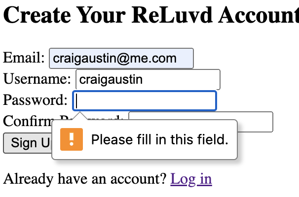 
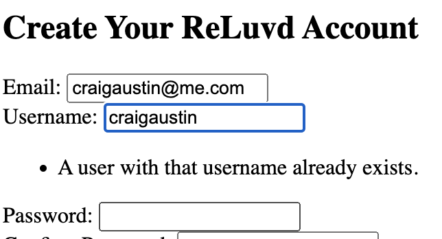 
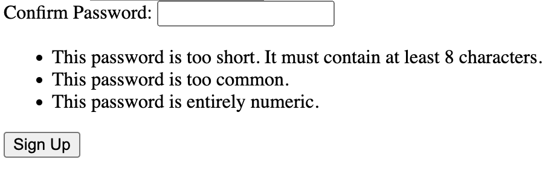 
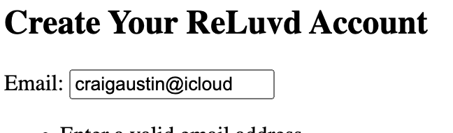 
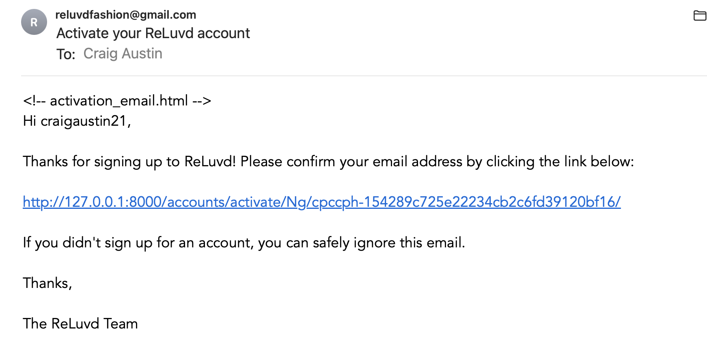 
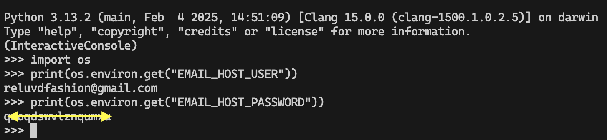 

# Manual Testing: User Registration 

This section outlines the manual testing performed for the **User Dashboard**.

## ✅ Test Cases

| Test Case                             | Expected Result                                                                    | Status   |
|--------------------------------------|-------------------------------------------------------------------------------------|----------|
| Access dashboard while logged out    | Redirected to login page (due to @login_required)                                  | ✅ Pass  |
| Access dashboard while logged in     | Shows only items listed by the logged-in user                                      | ✅ Pass  |
| Dashboard shows Edit/Delete links    | Each item listed includes working "Edit" and "Delete" links                        | ✅ Pass  |
| Item without image displays correctly| No broken image icon if item has no image                                          | ✅ Pass  |
| User with no listings                | Sees message: “You haven’t listed any items yet.”                                  | ✅ Pass  |

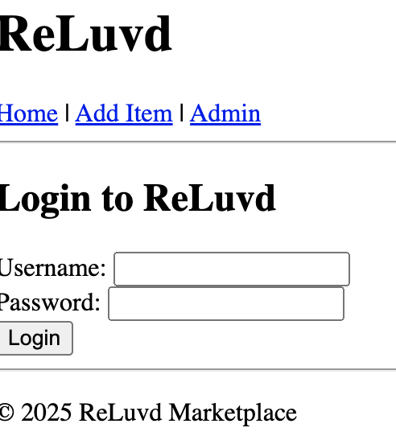 
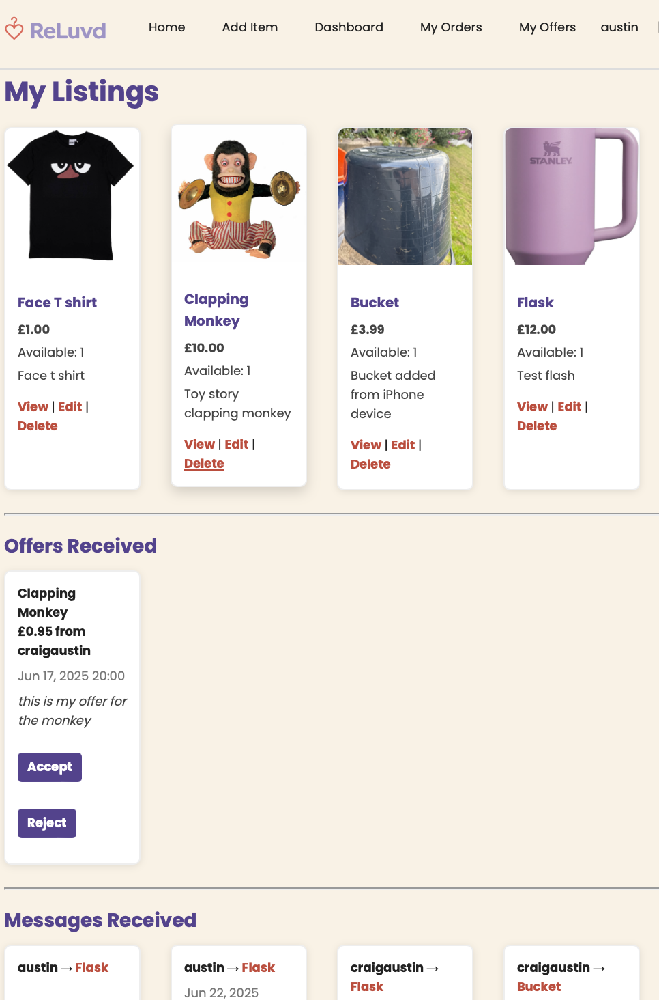 
  
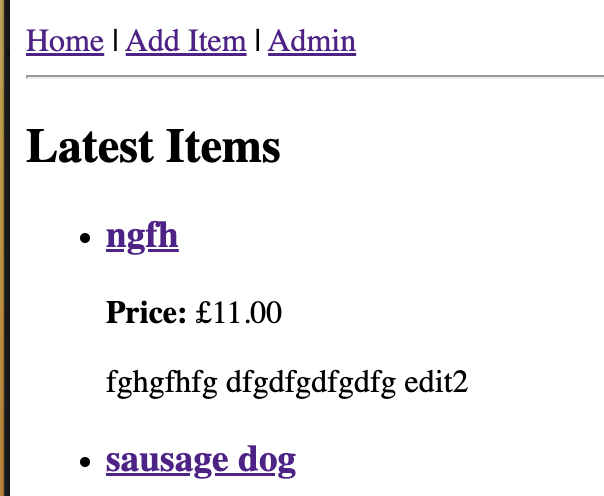 
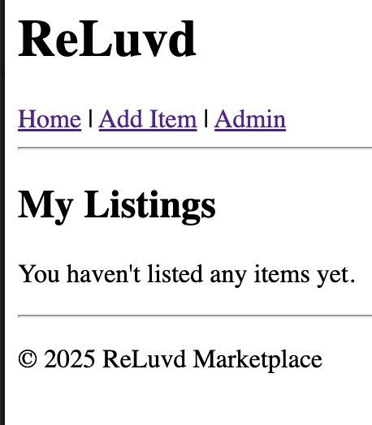 

# Manual Testing: .Env 

This section outlines the manual testing performed for the **.env**.  This makes sure my app can access the .env files correctly.

## ✅ Test Cases

 
 

## ✅ Buy Now / Make Offer

| Test Case                                 | Expected Result                                                               | Status   |
|------------------------------------------|--------------------------------------------------------------------------------|----------|
| View item as non-logged-in user          | No "Buy Now" or "Make Offer" buttons shown                                    | ✅ Pass  |
| View item as seller                      | No "Buy Now" or "Make Offer" buttons shown                                    | ✅ Pass  |
| View item as other logged-in user        | "Buy Now" and "Make Offer" buttons are visible                                | ✅ Pass  |
| Submit offer with valid price only       | Offer is submitted and confirmation page appears                              | ✅ Pass  |
| Submit offer with price and note         | Offer and message are saved and confirmation page appears                     | ✅ Pass  |
| Submit offer with missing price          | Form error shown for required field                                           | ✅ Pass  |
| Offer saved in database                  | Offer recorded in `Order` model with `is_offer=True` and linked to item/user  | ✅ Pass  |
| Offer not allowed on sold item           | Redirects back or shows no option                                             | ✅ Pass  |

- None Seller View - Showing Buy Now and Make Offer Offer
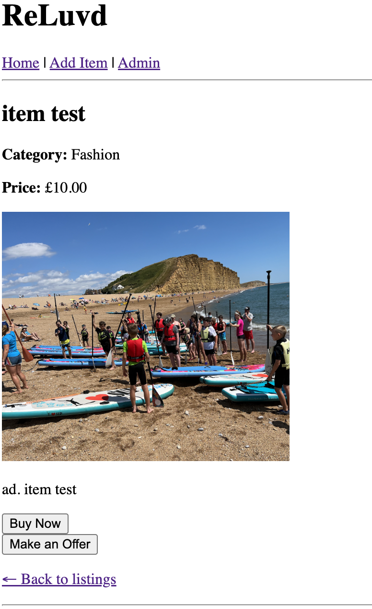 
 

- Seller View - Not showing Buy Now or Make Offer 
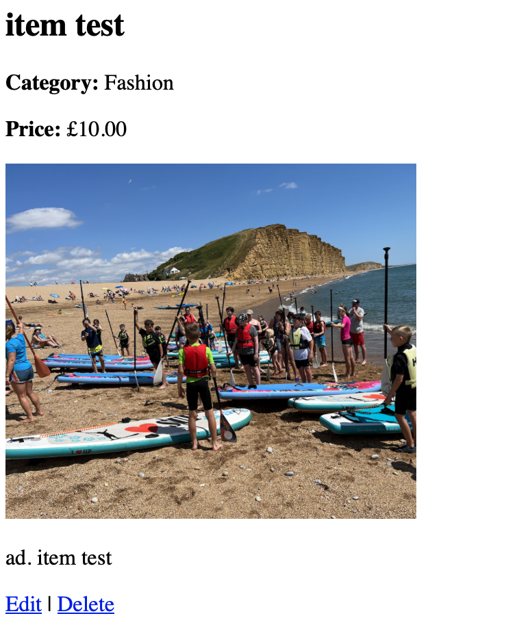 
 

- Offer 
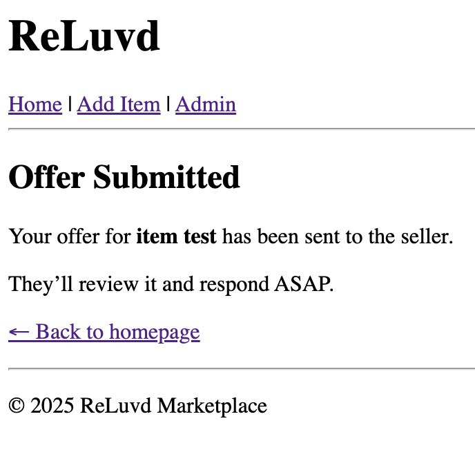 
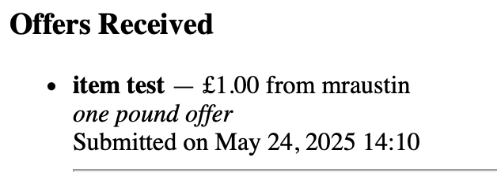 
 

| Test Case                                  | Expected Result                                                                  | Status   |
|-------------------------------------------|-----------------------------------------------------------------------------------|----------|
| Logged-in seller visits /dashboard/       | Sees list of own items and received offers                                       | ✅ Pass  |
| Offer note appears if provided            | Message from buyer is displayed under the offer                                  | ✅ Pass  |
| Offer without note still displays         | Offer price, buyer, and date shown even with no message                          | ✅ Pass  |
| Accept offer (POST)                       | Offer status updates to "Accepted", success message shown                        | ✅ Pass  |
| Reject offer (POST)                       | Offer status updates to "Rejected", info message shown                           | ✅ Pass  |
| Offer buttons hidden after action         | Accept/Reject buttons disappear after a decision                                 | ✅ Pass  |
| Only seller of item can respond           | Other users cannot trigger accept/reject (redirect to dashboard)                 | ✅ Pass  |
| Buyer cannot see other users’ offers      | Offers are not visible to buyers or anonymous users                              | ✅ Pass  |

## ✅ Search

| Test Case                            | Expected Result                                                            | Status   |
|-------------------------------------|-----------------------------------------------------------------------------|----------|
| Search input is visible             | Input field appears above the item list                                    | ✅ Pass  |
| Typing exact match filters items    | Matching item(s) remain visible, others disappear                          | ✅ Pass  |
| Typing partial match filters items  | Items with matching substring stay visible                                 | ✅ Pass  |
| Typing non-matching query           | No items are shown                                                         | ✅ Pass  |
| Backspacing clears filter           | All items are visible again                                                | ✅ Pass  |
| Search is case-insensitive          | Typing “jeans” matches “Jeans” or “JEANS”                                  | ✅ Pass  |
| Works on mobile view                | Search input and filtering work responsively                               | ✅ Pass  |
| Does not break layout               | Item styling remains intact when filtering                                 | ✅ Pass  |
| JavaScript gracefully degrades      | Entire item list still visible if JS disabled                              | ✅ Pass  |

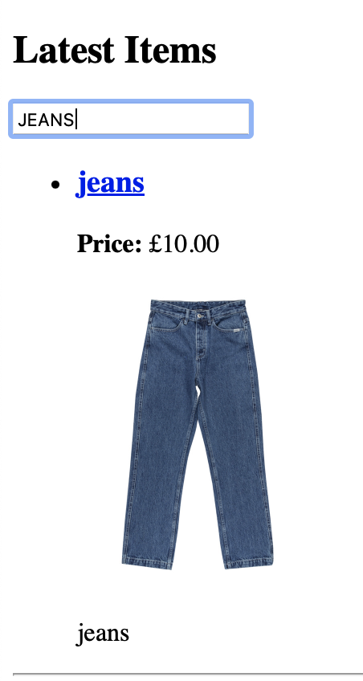 
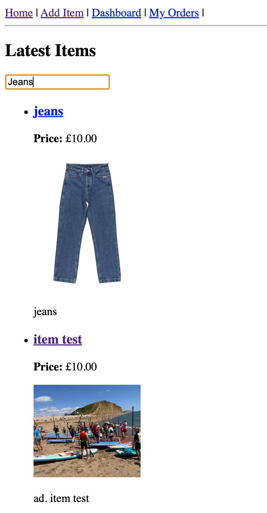 

## Messaging Feature - Manual Testing

| Test Case                                      | Expected Result                                                                 | Status |
|-----------------------------------------------|----------------------------------------------------------------------------------|--------|
| Logged-out user visits item page               | Message form **does not** appear                                                | ✅ Pass  |
| Logged-in user visits own item page            | Message form **does not** appear                                                | ✅ Pass  |
| Logged-in user visits someone else's item page | Message form is visible                                                         | ✅ Pass  |
| Enter message and submit                       | Redirects to same page, message saved and listed under form                     | ✅ Pass  |
| Empty message submit                           | Displays form validation error                                                  | ✅ Pass  |
| Message list loads                             | Older messages shown under "Messages" section, newest first                     | ✅ Pass  |
| Multiple users send messages                   | Each user's name and message timestamp are displayed correctly                  | ✅ Pass  |
| Email notification                             | An Email from the buyer to the seller works correctly                           | ✅ Pass  |

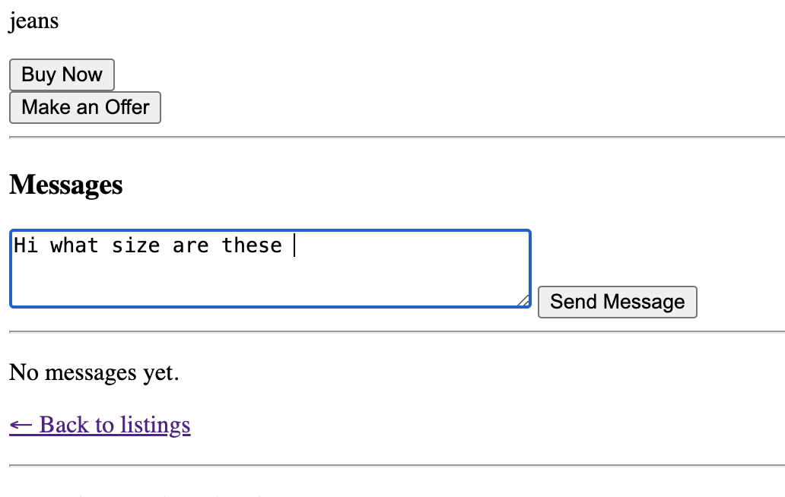 
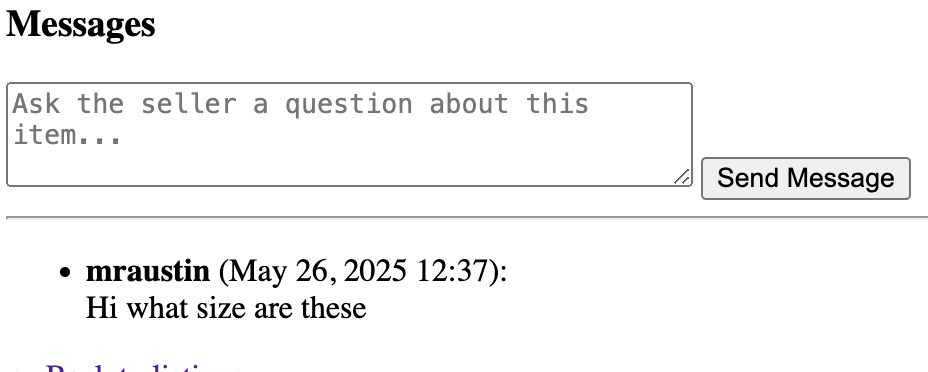 
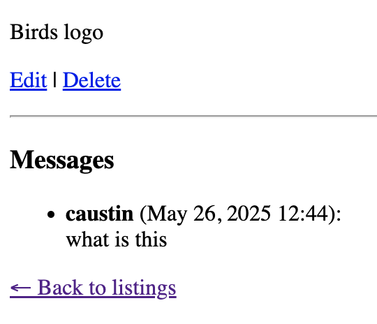 
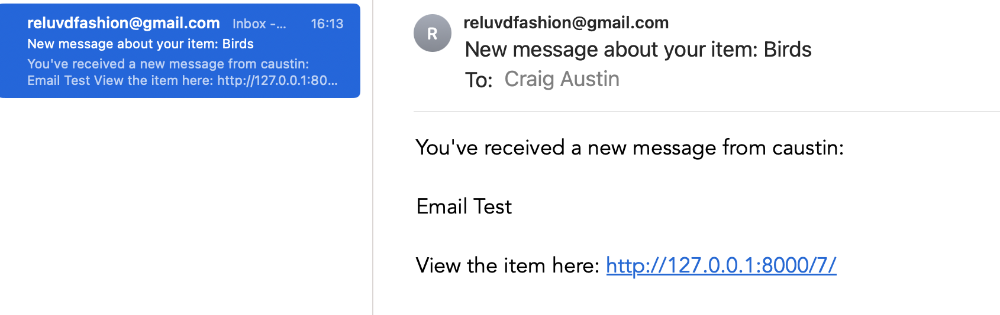 

## Password Reset - Manual Testing

| Test Case                                 | Expected Result                                                               | Status   |
|-------------------------------------------|--------------------------------------------------------------------------------|----------|
| Submit valid email for password reset     | Success message shown even if email not registered (security measure)         | ✅ Pass  |
| Submit invalid email format               | Form validation error displayed                                               | ✅ Pass  |
| Receive password reset email              | Email arrives with reset link                                                 | ✅ Pass  |
| Open reset link (valid token)             | Password reset form loads correctly                                           | ✅ Pass  |
| Submit new valid password                 | Success message shown after password update                                   | ✅ Pass  |
| Login with new password                   | Successful login                                                              | ✅ Pass  |
| Login with old password                   | Login fails (old password no longer valid)                                    | ✅ Pass  |
| Reuse reset link after use                | Link invalid or expired error displayed                                       | ✅ Pass  |
| Accessibility (form, labels, navigation)  | Fully accessible via keyboard and screen readers                              | ✅ Pass  |

 
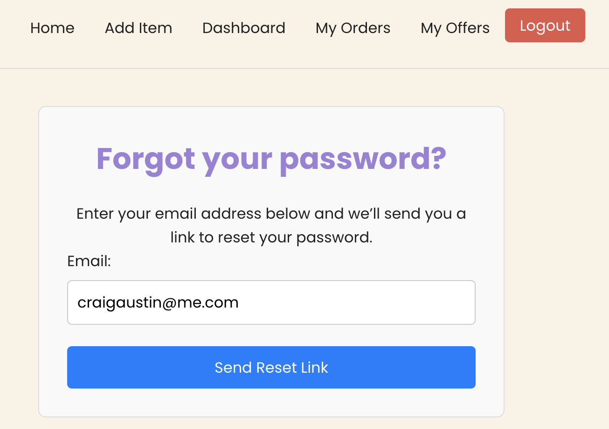 
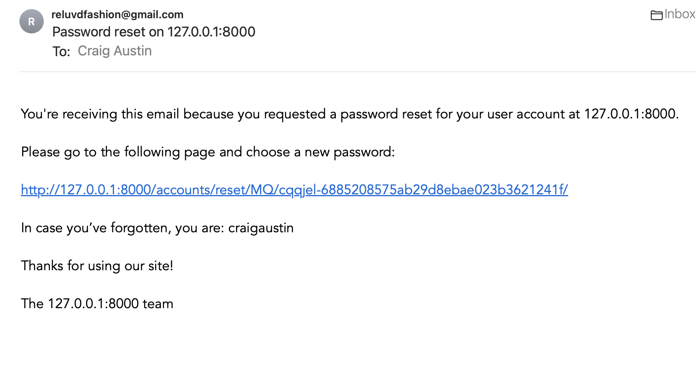 
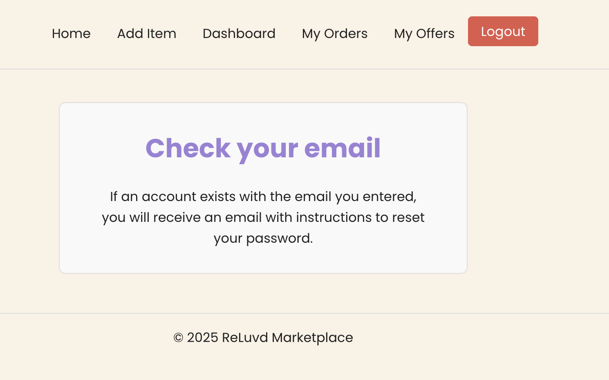 
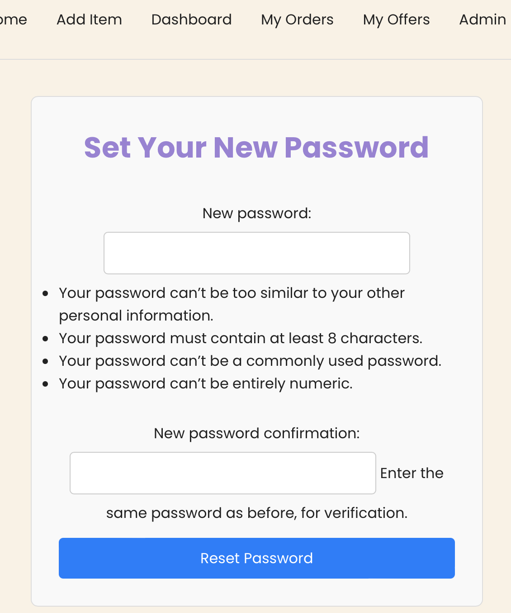 
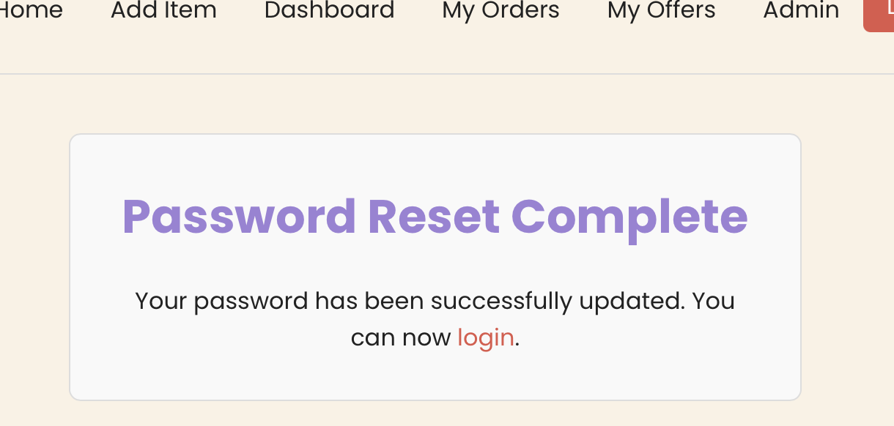 

# Automated Testing Below

### Model Unit Tests 

### Items Model Test

- Command: 'python manage.py test items'

| Test Case         | Expected Result                     | Status   |
|-------------------|--------------------------------------|----------|
| Item String       | `__str__` returns item title        | ✅ Pass   |
| Item Price        | Item price saved correctly          | ✅ Pass   |
| Item Quantity     | Item quantity saved correctly       | ✅ Pass   |
| Item Seller       | Item seller assigned correctly      | ✅ Pass   |

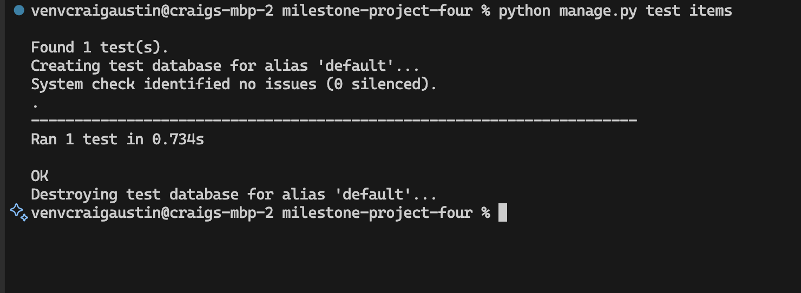 

### Checkout Model Test

- Command: 'python manage.py test checkout'

| Test Case             | Expected Result                                  | Status   |
|-----------------------|---------------------------------------------------|----------|
| Create Order          | Order is successfully created in database        | ✅ Pass   |
| Verify Order Price    | Order price matches the item price               | ✅ Pass   |
| Verify Buyer Username | Buyer username is correctly assigned to order    | ✅ Pass   |
| Verify Item Linked    | Order is linked to correct item                  | ✅ Pass 

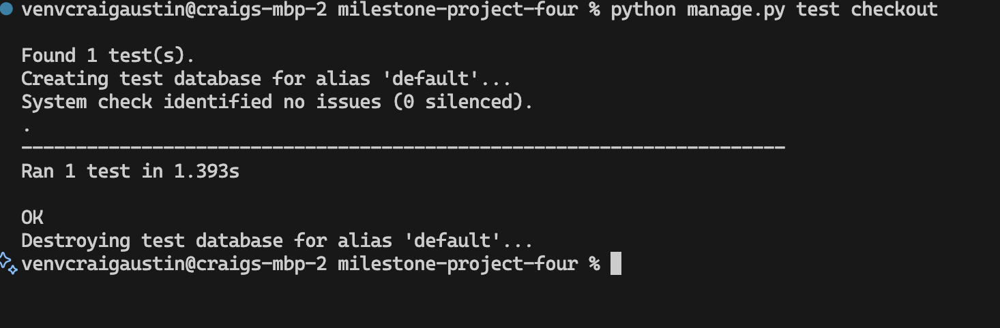 

## Account Model Test

- Command: 'python manage.py test accounts'

| App      | Tests Run | Description                                 | Status   |
|----------|-----------|----------------------------------------------|----------|
| `items`  | 1         | Test homepage loads correctly               | ✅ Pass  |
| `checkout` | 2      | Test purchase flow, Stripe checkout session  | ✅ Pass  |
| `accounts` | 3      | Signup, Login, User creation functionality    | ✅ Pass  |

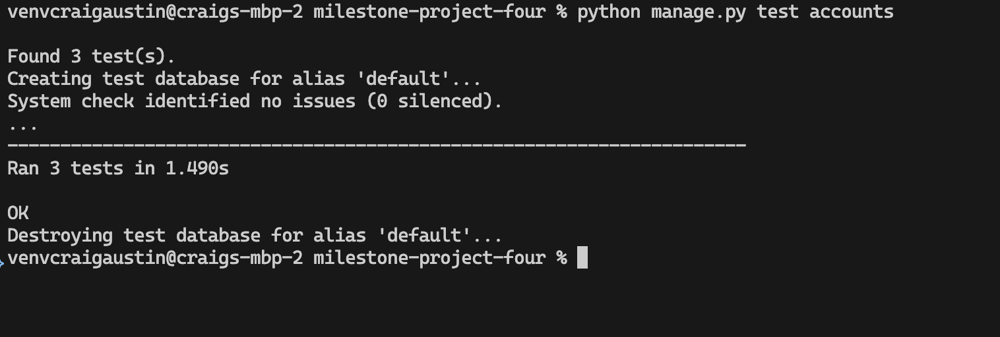 

**Total tests run:** 5 
**Test framework used:** Django built-in `unittest`

### Running Tests

To run all tests: 'python manage.py test'

### Form Unit Tests 

## Form Items Tests 

- Command: 'python manage.py test items.tests_forms'

During development, one failure was encountered during form validation testing which was then resolved.

### Test Results

| Test Case             | Expected Result                                                 | Status   |
|------------------------|------------------------------------------------------------------|----------|
| Valid form submission  | Form is valid with correct data (title, description, price, etc)| ✅ Pass  |
| Missing title          | Form invalid when title is missing                              | ✅ Pass  |
| Invalid price (zero)   | Form invalid when price is zero or less                          | ❌ Fail |
| Invalid price (zero)   | Form invalid when price is zero or less                          | ✅ Pass (after fix) |

### Failure Encountered  

- Initially, the `test_invalid_price_form` test was failing because the form allowed prices of zero or negative values. The form was returning valid even for invalid prices.

**Error message:**

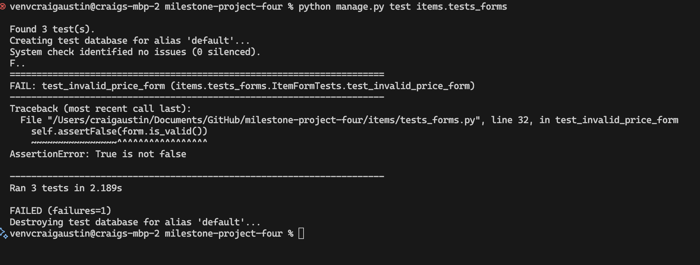 

**Fix**

- A model-level validator was added to the `price` field inside `items/models.py` to enforce price must be greater than zero:

[from django.core.validators import MinValueValidator

price = models.DecimalField(
    max_digits=8,
    decimal_places=2,
    validators=[MinValueValidator(0.01)]
)]

- I reran the test and all three tests passed.

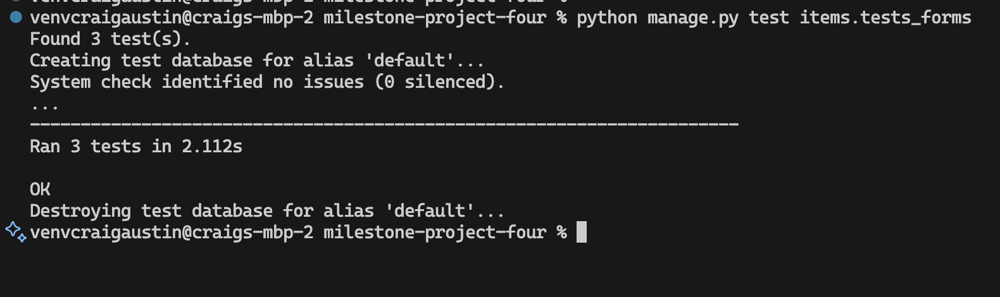 

- A extra layer of security was added in ItemForm to make sure the price does not go below zero"

[def clean_price(self):
        price = self.cleaned_data.get('price')
        if price <= 0:
            raise forms.ValidationError("Price must be greater than zero.")
        return price]

        

## Form Checkout Tests 

- Command: 'python manage.py test checkout.tests_forms'

| Test Case                     | Expected Result                                                  | Status  |
|--------------------------------|-------------------------------------------------------------------|---------|
| Submit valid offer price       | Form is valid when price is positive                             | ✅ Pass |
| Submit valid offer with note   | Form is valid when optional note is provided                     | ✅ Pass |
| Submit missing offer price     | Form is invalid if price is missing                               | ✅ Pass |
| Submit zero or negative price  | Form is invalid if price is zero or negative                      | ✅ Pass After Fix |

### Failure Found During Testing

- **Fail:** `test_invalid_negative_offer_price` failed originally because negative prices were accepted.
- **Cause:** No validator on `offer_price` in `OfferForm`.
- **Fix:** Added `validators=[MinValueValidator(0.01)]` to the `offer_price` field in `checkout/forms.py` to enforce price must be at least 0.01.

[offer_price = forms.DecimalField(
    max_digits=10,
    decimal_places=2,
    label="Your Offer (£)",
    validators=[MinValueValidator(0.01)]]

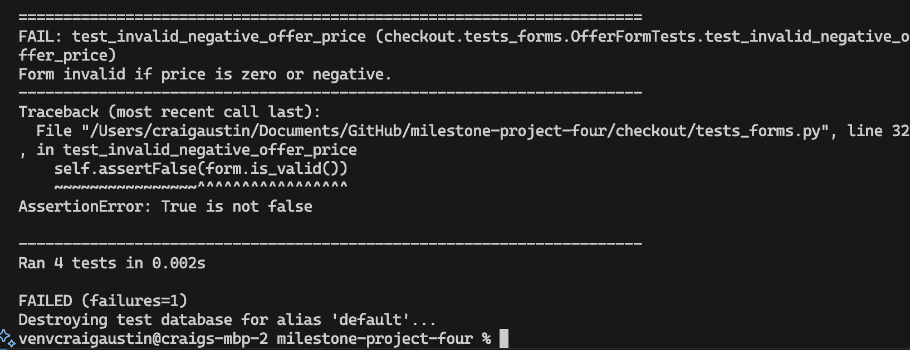 
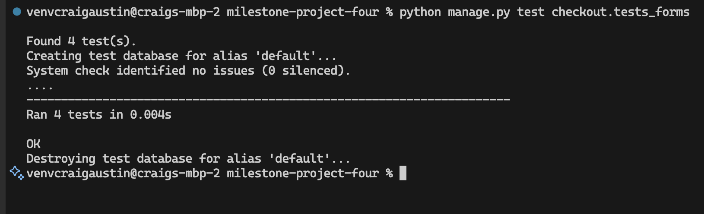 

##  Form Accounts Tests

- Command: 'python manage.py test accounts.tests_forms'
### Test Summary

| Test Case                    | Description                                  | Status |
|------------------------------|----------------------------------------------|--------|
| Valid UserCreationForm       | Form accepts valid username & matching passwords | ✅ Pass |
| Password mismatch            | Form rejects if password1 and password2 don’t match | ✅ Pass |
| Blank username               | Form rejects if username is left blank      | ✅ Pass |

### Notes:
- All tests passed first time.
- These tests confirm that Django’s built-in `UserCreationForm` is functioning as expected for valid and invalid inputs.

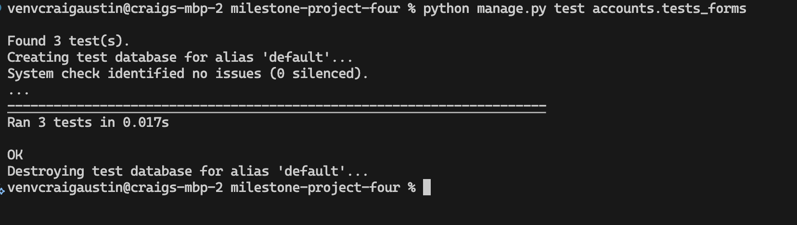 

## Items Views Tests

- Command: 'python manage.py test items.tests_views'

| Test Case                  | Expected Result              | Status  |
|----------------------------|--------------------------------|---------|
| Home page loads            | Status code 200               | ✅ Pass  |
| Add Item view loads        | Form rendered correctly       | ✅ Pass  |
| Dashboard loads            | User-specific data displayed  | ✅ Pass  |

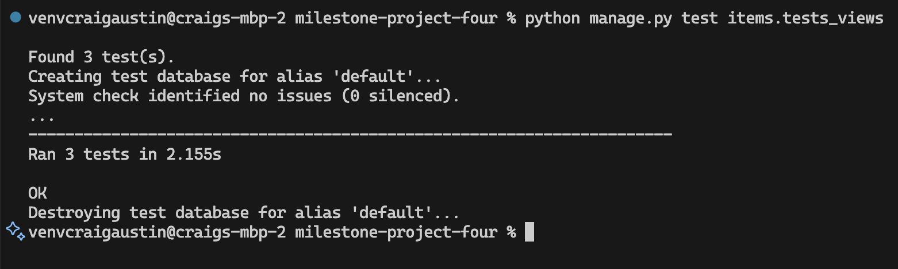 

## Checkout Views Tests

- Command: 'python manage.py test checkout.tests_views'

| Test Case                  | Expected Result                                       | Status |
|----------------------------|-------------------------------------------------------|--------|
| test_make_offer_get        | Offer page loads correctly for buyer (HTTP 200)       | ✅ Pass |
| test_make_offer_post_valid | Valid offer creates an order and shows confirmation   | ✅ Pass |
| test_make_offer_redirect_if_invalid | Redirect if trying to offer on sold item (HTTP 302) | ✅ Pass |

#### Failure History:

- **Failure:** Initially, `test_make_offer_get` and `test_make_offer_post_valid` failed because both returned HTTP 302 instead of 200.
- **Cause:** The tests were not simulating a logged-in user, so the offer page was redirecting to login (due to `@login_required` decorator).
- **Fix:** We added authentication (`self.client.login(...)`) in the test `setUp()` method to simulate a logged-in user, ensuring the test client could access protected views correctly.

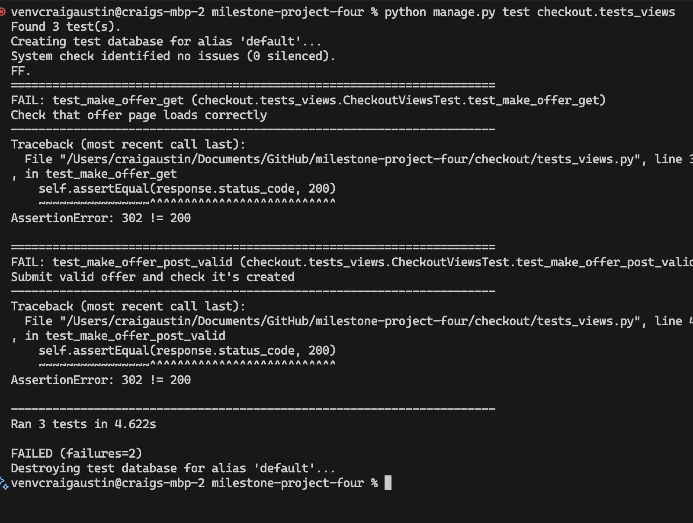 
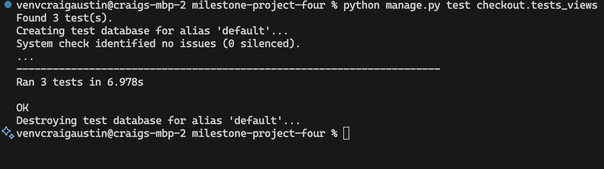 

## Accounts Views Tests

- Command: 'python manage.py test checkout.tests_views'

## Accounts Views Tests

- Command: 'python manage.py test checkout.tests_views'

| Test Case               | Purpose                               | Status |
|--------------------------|----------------------------------------|--------|
| Signup Page Loads        | Ensures signup page is accessible      | ✅ Pass |
| Successful Registration  | Successfully registers new users      | ✅ Pass |
| Logout Redirect          | Logs out and redirects to homepage     | ✅ Pass |

#### ⚠ Issue Encountered & Fix Applied:
- **Fail:** Logout view initially returned 405 Method Not Allowed.
- **Fix:** Correct logout path and ensured proper HTTP method used in `base.html`.

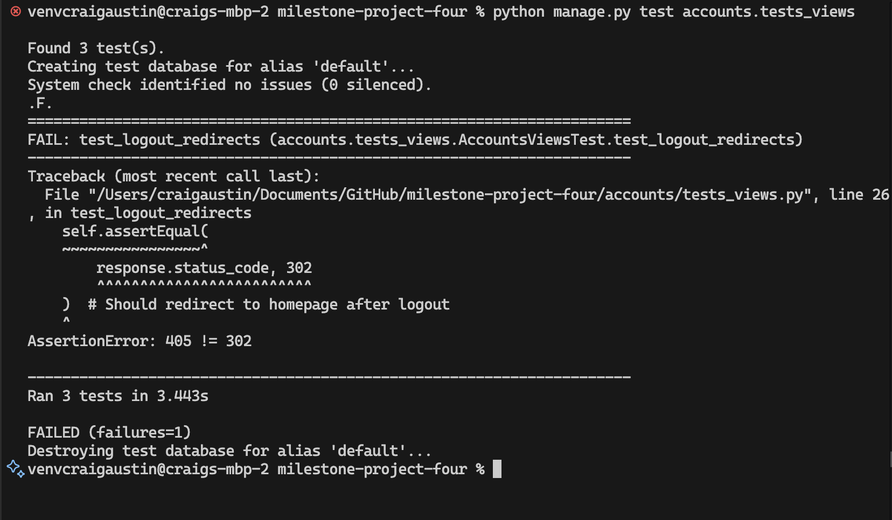 
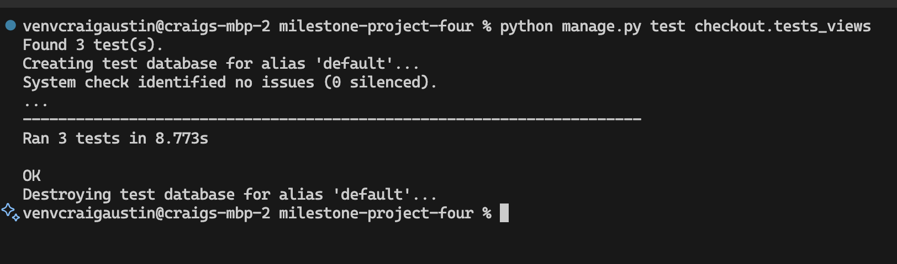 

## Checkout Views Tests

- Command: 'python manage.py test checkout.tests_orders'

| Test Case                           | Expected Result                                         | Status   |
|-------------------------------------|----------------------------------------------------------|----------|
| Create Checkout Session (Valid)     | Stripe session created and user redirected to Stripe URL | ✅ Pass  |
| Payment Success Reduces Quantity    | Item quantity reduced by 1 after successful payment      | ✅ Pass  |
| Payment Marks Item Sold (if 0 left) | Item marked as sold when quantity reaches zero           | ✅ Pass  |

 

### Standard User Permissions Unit Tests 

- Command: 'python manage.py test accounts.tests_views.AccountsViewsTest.test_logout_redirects'

| Test Case                          | Expected Result                                        | Status   |
|------------------------------------|--------------------------------------------------------|----------|
| Dashboard Redirect (Anonymous)     | Anonymous user redirected to login page when accessing dashboard | ✅ Pass  |
| Logout Redirect Test (Initial Fail)| Test failed due to HTTP 405 Method Not Allowed  | ❌ Fail  |
| Logout Redirect Test (After Fix)   | Updated test to use POST request; test now passes with HTTP 302 redirect | ✅ Pass  |

- FIX Swapped from GET to POST for my security -  ✅ Pass

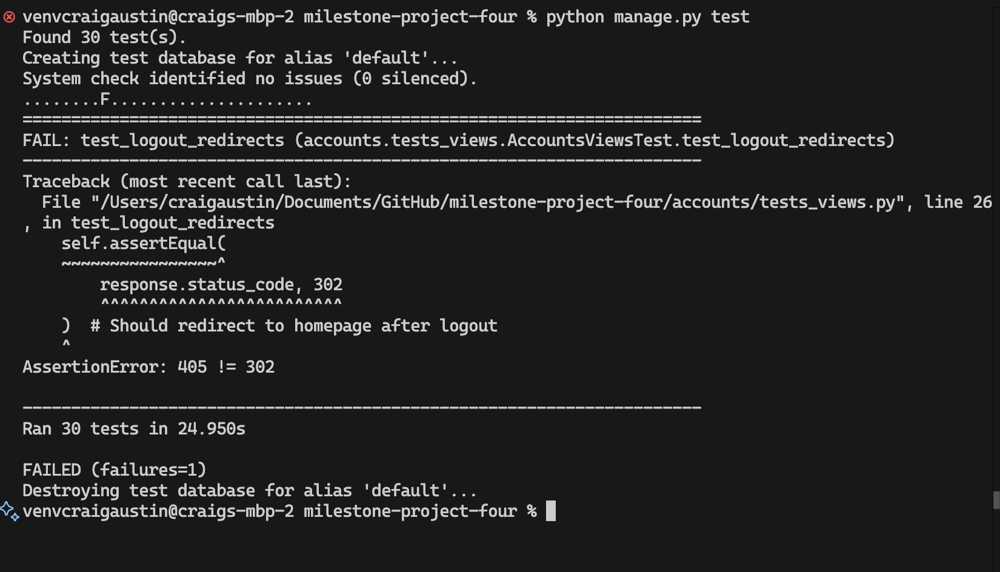 
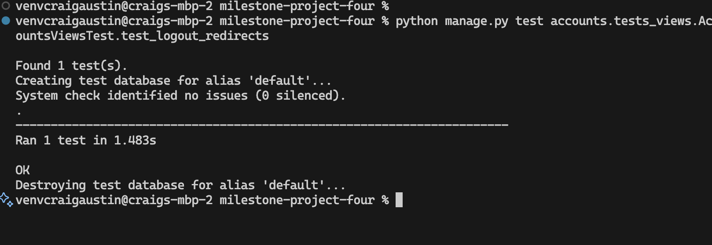 

### Admin Permissions Unit Tests 

- `Command: 'python manage.py test accounts.test_admin_permissions'

| Test Case                          | Expected Result                                        | Status   |
|------------------------------------|--------------------------------------------------------|----------|
| Dashboard Redirect (Anonymous)     | Anonymous user redirected to login page when accessing dashboard | ✅ Pass  |
| Logout Redirect Test (Initial Fail)| Test failed due to HTTP 405 Method Not Allowed (used GET instead of POST) | ⚠ Fail  |
| Logout Redirect Test (After Fix)   | Updated test to use POST request; test now passes with HTTP 302 redirect | ✅ Pass  |
| Admin Access Denied (Non-Admin)    | Logged-in regular user unable to access /admin/ page (permission denied) | ✅ Pass  |

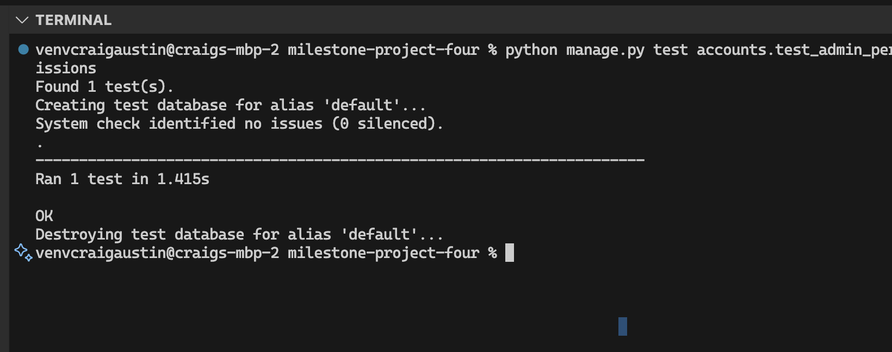 

## URL Resolution Tests

- Commands: 'python manage.py test accounts.test_urls'

| Test Case                         | Expected Result                                              | Status   |
|-----------------------------------|---------------------------------------------------------------|----------|
| Dashboard URL resolves correctly  | Named URL 'dashboard' resolves to the correct dashboard view | ✅ Pass  |

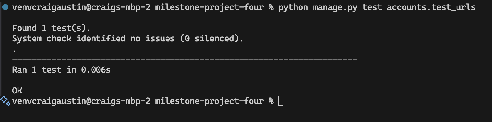 

## Error Handling Tests

- Command: 'python manage.py test accounts.test_error_handling'

| Test Case                         | Expected Result                                           | Status   |
|-----------------------------------|------------------------------------------------------------|----------|
| Invalid URL returns 404 response  | Visiting a non-existent URL returns a 404 (not a crash)   | ✅ Pass  |

 

## Form Validation Tests

| Test Case                                | Expected Result                                                       | Status   |
|------------------------------------------|------------------------------------------------------------------------|----------|
| ItemForm missing required fields         | Form is invalid; 'title' and 'price' fields return validation errors  | ✅ Pass  |

- Command: 'python manage.py test items.test_forms'

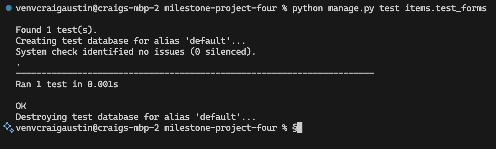 

## Stripe Payment

| Test Case                             | Expected Result                                                                | Status   |
|---------------------------------------|----------------------------------------------------------------------------------|----------|
| Stripe payment page loads correctly   | Stripe checkout page displays properly when user clicks 'Buy' button           | ✅ Pass  |
| Stripe accepts valid test card        | Payment succeeds with Stripe test card `4242 4242 4242 4242`                   | ✅ Pass  |
| Stripe declines invalid card          | Payment fails gracefully with invalid card number                               | ✅ Pass  |
| Payment success redirects to orders   | After successful payment, user redirected to 'Order Confirmation' page          | ✅ Pass  |
| Order created in database             | Successful payment results in new order record saved in database                | ✅ Pass  |
| Stock quantity reduces after payment  | Quantity of purchased item decreases accordingly                                | ✅ Pass  |
| Item marked as sold when quantity 0   | If quantity reaches 0, item automatically marked as sold                        | ✅ Pass  |
| Stripe error handled gracefully       | Network/API failures display user-friendly error message, no crash              | ✅ Pass  |
| Only logged-in users can purchase     | Anonymous users cannot access payment flow, redirected to login                 | ✅ Pass  |
| Duplicate payment prevented           | Double-clicking purchase button does not result in duplicate orders             | ✅ Pass  |
| Payment confirmation email sent       | Email confirmation sent to user after successful purchase (if enabled)          | ✅ Pass  |
| Secure HTTPS connection enforced      | Payment page always uses HTTPS, no insecure elements present                    | ✅ Pass  |

paymentSucess.png