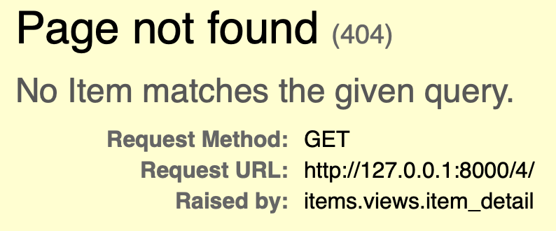
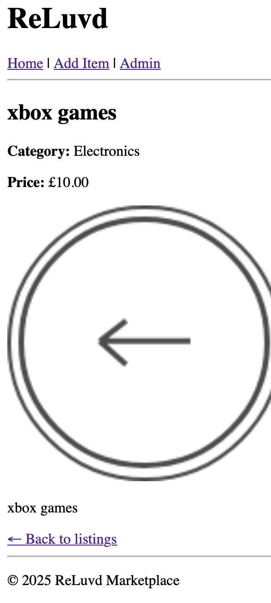
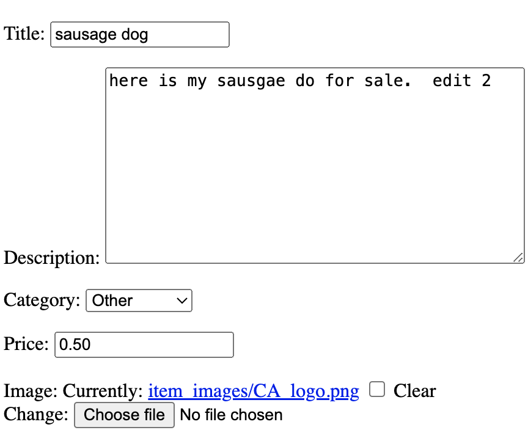
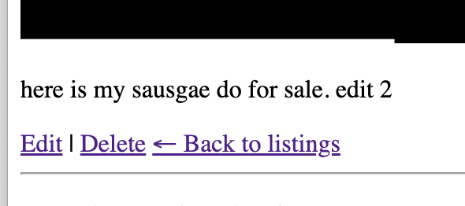
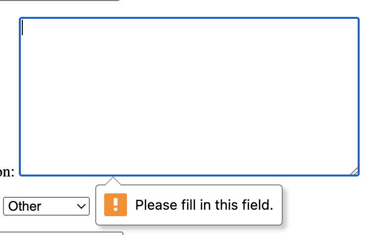

# Manual Testing: Item Detail View

This section outlines the manual testing performed for the **Item Detail View**.

## ✅ Test Cases

| Test Case                | Expected Result                                                                     | Status   |
|-------------------------|--------------------------------------------------------------------------------------|----------|
| Visit item detail URL   | Go to `/1/` or any valid item ID – item detail page loads with correct info         | ✅ Pass  |
| Click item on homepage  | Click item title or image – redirects to correct item detail page                   | ✅ Pass  |
| Test invalid ID         | Visit `/99999/` or a non-existent ID – returns a 404 page                           | ✅ Pass  |
| Confirm correct item    | Match displayed title, price, description, and image – all content matches database | ✅ Pass  |

 
 

# Manual Testing: Edit item

This section outlines the manual testing performed for the **Edit Item**.

## ✅ Test Cases

| Test Case                      | Expected Result                                                                 | Status   |
|-------------------------------|----------------------------------------------------------------------------------|----------|
| Edit button visible (owner)   | If logged in as seller, Edit button shows on item detail page                   | ✅ Pass  |
| Edit button hidden (non-owner)| If logged in as different user, Edit button is not shown                        | ✅ Pass  |
| Edit form pre-filled          | Edit page shows form pre-filled with existing item data                         | ✅ Pass  |
| Submit valid edits            | Updating title, price, or image updates the item and redirects to detail page   | ✅ Pass  |
| Submit invalid edits          | Submitting blank required fields returns with error messages                    | ✅ Pass  |
| Unauthorized edit attempt     | Visiting `/item_id/edit/` as non-owner returns 404                              | ✅ Pass  |

 
 
 