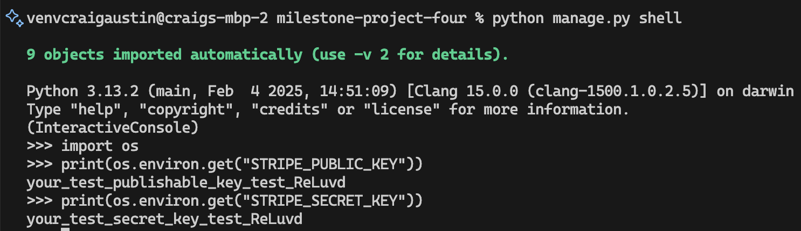

# Key 

✅ - PASS

❌ - Fail

# Manual Testing: Item Detail View

This section outlines the manual testing performed for the **Item Detail View**.

## ✅ Test Cases

| Test Case                | Expected Result                                                                     | Status   |
|-------------------------|--------------------------------------------------------------------------------------|----------|
| Visit item detail URL   | Go to `/1/` or any valid item ID – item detail page loads with correct info         | ✅ Pass  |
| Click item on homepage  | Click item title or image – redirects to correct item detail page                   | ✅ Pass  |
| Test invalid ID         | Visit `/99999/` or a non-existent ID – returns a 404 page                           | ✅ Pass  |
| Confirm correct item    | Match displayed title, price, description, and image – all content matches database | ✅ Pass  |

 
 

# Manual Testing: Edit item

This section outlines the manual testing performed for the **Edit Item**.

## ✅ Test Cases

| Test Case                      | Expected Result                                                                 | Status   |
|-------------------------------|----------------------------------------------------------------------------------|----------|
| Edit button visible (owner)   | If logged in as seller, Edit button shows on item detail page                   | ✅ Pass  |
| Edit button hidden (non-owner)| If logged in as different user, Edit button is not shown                        | ✅ Pass  |
| Edit form pre-filled          | Edit page shows form pre-filled with existing item data                         | ✅ Pass  |
| Submit valid edits            | Updating title, price, or image updates the item and redirects to detail page   | ✅ Pass  |
| Submit invalid edits          | Submitting blank required fields returns with error messages                    | ✅ Pass  |
| Unauthorized edit attempt     | Visiting `/item_id/edit/` as non-owner returns 404                              | ✅ Pass  |

 
 
 

# Manual Testing: User Registration 

This section outlines the manual testing performed for the **User Registration**.

## ✅ Test Cases

| Test Case                                     | Expected Result                                                                 | Status   |
|----------------------------------------------|----------------------------------------------------------------------------------|----------|
| Submit valid signup form                     | Form submits successfully and redirects to login page with success message      | ✅ Pass  |
| Submit with missing fields                   | Error messages shown (e.g., "This field is required")                           | ✅ Pass  |
| Submit with mismatched passwords             | Form errors appear for password confirmation                                    | ✅ Pass  |
| Email is sent after valid registration       | Activation email is sent to the provided email address                          | ✅ Pass  |
| Click activation link in email               | User account is activated and redirected to login page                          | ✅ Pass  |
| Try login before activation                  | Login fails with “account inactive” or no access                                | ✅ Pass  |
| Use invalid activation token                 | Renders `activation_invalid.html` with error message                            | ✅ Pass  |
| Reuse valid activation link                  | Gracefully handles with “already activated” or success message again            | ✅ Pass  |
| Email address stored in database             | `User.email` field correctly populated after registration                        | ✅ Pass  |

 
 
 
 
 
 

# Manual Testing: User Registration 

This section outlines the manual testing performed for the **User Dashboard**.

## ✅ Test Cases

| Test Case                             | Expected Result                                                                    | Status   |
|--------------------------------------|-------------------------------------------------------------------------------------|----------|
| Access dashboard while logged out    | Redirected to login page (due to @login_required)                                  | ✅ Pass  |
| Access dashboard while logged in     | Shows only items listed by the logged-in user                                      | ✅ Pass  |
| Dashboard shows Edit/Delete links    | Each item listed includes working "Edit" and "Delete" links                        | ✅ Pass  |
| Item without image displays correctly| No broken image icon if item has no image                                          | ✅ Pass  |
| User with no listings                | Sees message: “You haven’t listed any items yet.”                                  | ✅ Pass  |

 
 
  
 
 

# Manual Testing: .Env 

This section outlines the manual testing performed for the **.env**.  This makes sure my app can access the .env files correctly.

## ✅ Test Cases

 
 

## ✅ Buy Now / Make Offer

| Test Case                                 | Expected Result                                                               | Status   |
|------------------------------------------|--------------------------------------------------------------------------------|----------|
| View item as non-logged-in user          | No "Buy Now" or "Make Offer" buttons shown                                    | ✅ Pass  |
| View item as seller                      | No "Buy Now" or "Make Offer" buttons shown                                    | ✅ Pass  |
| View item as other logged-in user        | "Buy Now" and "Make Offer" buttons are visible                                | ✅ Pass  |
| Submit offer with valid price only       | Offer is submitted and confirmation page appears                              | ✅ Pass  |
| Submit offer with price and note         | Offer and message are saved and confirmation page appears                     | ✅ Pass  |
| Submit offer with missing price          | Form error shown for required field                                           | ✅ Pass  |
| Offer saved in database                  | Offer recorded in `Order` model with `is_offer=True` and linked to item/user  | ✅ Pass  |
| Offer not allowed on sold item           | Redirects back or shows no option                                             | ✅ Pass  |

- None Seller View - Showing Buy Now and Make Offer Offer
 
 

- Seller View - Not showing Buy Now or Make Offer 
 
 

- Offer 
 
 
 

